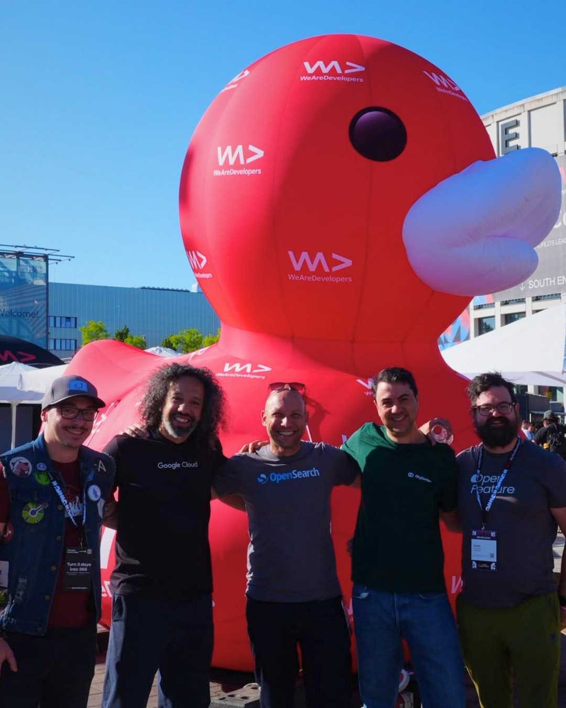

# WeAreDevelopers 2026 is in the books!

It's been my (I think) fourth time at the event - my first time was about 10 years ago in Vienna, then I joined the previous three events in Berlin.

TL;DR: fine event, well organized (as always) - but as always.

I've had the pleasure to speak at WaD for the third time now: first talk was on the "virtual track".. I still tell myself that counts, and I got a speaker ticket 🤷‍♂️
The second talk was last year at the airstage.. the great open caravan stage close to the outdoor food area. At first I thought I was downgraded, but actually I really enjoyed it, and the session was REALLY well attended, I guess ~100 people give or take.
This year I spoke at Stage 8, the Red Hat stage. Con - it's inside and usually very loud in there. Pro - they had headphones for the whole crowd, so that was a pleasant improvement.
My stage host this year was Alisa Reznik, great moderator and amazing human being (from what I could tell from 5min conversation)!
If you read this Alisa, feel free to share ;)

## Content

Again there were SO MANY talks, booths, people, speakers etc - simply overwelming!
But, WaD records everything and you can rewatch or get the summary for each talk, so thats nice - as they said, from 3 days to 365.
I honestly just watched two sessions:

- common OTEL mistakes by Juraci Kröhling (because he is a fellow CNCF Ambassador and asked us to come by 🤷‍♂️) - great talk, as always!
- the fireside chat with Werner Vogels - very interesting and amazing how this guy is still top of his game!

Apart from that I tried to visit each booth and speak to every vendor - usually that's what I try to focus on.
Personal opinion: talking to vendors, and seeing who is there again compared to last year, gives me a good idea of what is going on in the industry.
Plus, vendor conversations are not recorded and cannot be rewatched, talks can!
So I talked to pretty much everybody - in terms of companies - and my few learnings look something like this:

- AI EVERYWHERE!
- still a lot going on in the "traditional topics": security, observability, api management,.. but all focused on using or leveraging AI
- unfortunately there was no big WOW moment for me this time; as for example compared to the KubeCon 26 announcement of llm-d or retirement of ingress-nginx

## Fun stuff

Apart from vendors and talks, there were some more things worth mentioning:

- the CODE100 finale - a competition that went on for quite some time and had its finale at the WaD congress, live on stage
  - it's like brain sports for nerds. multiple choice quizzes and live coding (pair and single) in front of a quite large audience
  - I actually liked this kind of event very much - something you don't get to see anywhere else (on the big conference)
  - contrats Mirko (I hope I got that right) for taking home the trophy, and sharing this moment with your biggest supporter - although you had to kick her out first 😅
- the booth crawl! at Thursday afternoon/evening, vendors were encouraged to loosen up a little, hand out drinks and they even had a DJ on site
  - what started out really fun, unfortunately didn't last very long - the whole thing was over after about what felt like just an hour. some/many vendors didn't participate at all, and for most vendors the party didn't last very long.
- we were at the System of a Down concert at Olympiastadium on Wednesday, which was pure gold! Great evening, somewhat taxing on my voice when I had my talk the next day (totally worth it!)
- I met some of my fellow CNCF ambassadors again, which is always fun!

## Summary

TL;DR: I still like to be at WaD very much, and will definitely come back - preferably as a speaker if they want me again (I promise, I will do my best to hand in some good stuff again!).
Since I made it from virtual > small outdoor > regular indoor stage in three years, who knows, maybe I'll rock the main stage some time ;)
It's still quite sad to me, that there is no proper food or coffee (and only some water dispensers) included in the ticket price (for regular attendees), although I have to admit that food/drinks for speakers were really great.. so I'm not gonna complain here from my PoV.
