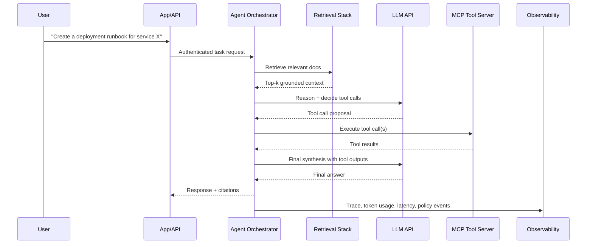

State-of-the-art AI systems are distributed systems. They combine LLM inference, retrieval, agent orchestration, external tools, and security controls into one runtime architecture that is observable and policy-driven [1], [2], [3].

## What is it?

An AI solution architecture is the end-to-end design of how user intent flows through:

- An application boundary (UI/API)
- An orchestration boundary (agent runtime + policies)
- A knowledge boundary (RAG, vector store, document store)
- An integration boundary (MCP and external APIs)
- A control boundary (IAM, secrets, audit, tracing)

This is much closer to a microservice topology than to "one model call and done."

## Why do we need it? Where do we use it?

Without architecture, AI prototypes fail in production because of missing controls: no access boundaries, no quality loop, no latency budget, no observability, and no incident response trail.

Typical usage:

- Enterprise copilots
- Automated support workflows
- Engineering assistants
- AI-enabled internal platforms

## History Lesson

| When | What                                                                              |
| ---- | --------------------------------------------------------------------------------- |
| 2020 | RAG architecture pattern formalized as model + retrieval [4].                     |
| 2023 | Function/tool calling became mainstream for practical agent execution [2], [5].   |
| 2024 | MCP introduced a common protocol model for tools, resources, and prompts [6].     |
| 2025 | MCP refined transports and protocol lifecycle behavior [1], [7].                  |
| 2025 | OpenAPI 3.2 strengthened machine-readable API contracts useful for tool APIs [8]. |

## Interaction with other topics?

- [LLMs](/kb/ai/llms): model capabilities and limits define architecture choices.
- [RAG](/kb/ai/rag): context grounding and retrieval quality.
- [MCP](/kb/ai/mcp): standard protocol for tool/resource integration.
- [Agents](/kb/ai/agents): orchestration logic, planning loops, and tool use.
- [AI APIs](/kb/ai/ai-apis): API interface design and contracts.
- [Security](/kb/ai/security): isolation, policy, and risk controls.

## How does it work?

### C4-style container architecture

```d2
direction: down

classes: {
  user: {
    style: {
      fill: "#E8F5E9"
      stroke: "#2E7D32"
      border-radius: 8
    }
  }
  app: {
    style: {
      fill: "#E3F2FD"
      stroke: "#1565C0"
      border-radius: 8
    }
  }
  ai: {
    style: {
      fill: "#FFF3E0"
      stroke: "#EF6C00"
      border-radius: 8
    }
  }
  data: {
    style: {
      fill: "#F3E5F5"
      stroke: "#6A1B9A"
      border-radius: 8
    }
  }
  sec: {
    style: {
      fill: "#FCE4EC"
      stroke: "#AD1457"
      border-radius: 8
    }
  }
}

person: "End User" {
  shape: person
  class: user
}

system: "AI Product (System Boundary)" {
  ui: "Web App / API Gateway" {
    class: app
  }

  orchestrator: "Agent Orchestrator (Container)" {
    planner: "Planner + Workflow State" {
      class: ai
    }
    policy: "Guardrail / Policy Engine" {
      class: sec
    }
    memory: "Session + Short-term Memory" {
      class: ai
    }
  }

  retrieval: "Retrieval Subsystem (Container)" {
    embed: "Embedding Service" {
      class: ai
    }
    vectordb: "Vector DB (ANN Index)" {
      class: data
    }
    docstore: "Object/Document Store" {
      class: data
    }
    rerank: "Re-ranker" {
      class: ai
    }
  }

  integration: "Tool Integration (Container)" {
    mcpclient: "MCP Client" {
      class: ai
    }
    toolapis: "Internal/External REST APIs" {
      class: app
    }
  }

  observability: "Observability (Container)" {
    traces: "Traces + Metrics + Eval Logs" {
      class: sec
    }
  }
}

providers: "Model Providers (External System)" {
  llmapi: "LLM Inference APIs (OpenAI/Anthropic/Gemini/etc.)" {
    class: ai
  }
}

mcpservers: "MCP Servers (External/Internal)" {
  tools: "Tool Servers (DB, CI/CD, Ticketing, Git, Browser)" {
    class: app
  }
}

security: "Security Services (External/Internal)" {
  iam: "IAM / OAuth / API Keys / mTLS" {
    class: sec
  }
  kms: "KMS / Secrets Manager" {
    class: sec
  }
}

person -> ui: "task request"
ui -> planner: "normalized user intent"
planner -> policy: "action plan proposal"
policy -> planner: "allow/deny + constraints"
planner -> llmapi: "reasoning + tool selection"
planner -> embed: "query embedding"
embed -> vectordb: "nearest-neighbor search"
vectordb -> rerank: "candidate passages"
rerank -> planner: "grounded context"
planner -> mcpclient: "tool invocation request"
mcpclient -> tools: "JSON-RPC tool calls"
planner -> toolapis: "REST/API calls"
planner -> traces: "spans, tokens, latencies"
llmapi -> traces: "model usage telemetry"
ui -> iam: "user authn/authz"
planner -> kms: "fetch runtime secrets"
```

### Communication model between parts

1. User request enters the app boundary with authenticated identity.
2. Agent planner decomposes the task into steps.
3. Policy engine constrains what the planner is allowed to execute.
4. Planner enriches context through retrieval (embeddings + vector search + rerank).
5. Planner invokes tools via MCP or direct APIs.
6. Planner synthesizes final response with explicit grounding and tool outputs.
7. Observability captures spans, costs, token usage, tool latency, and safety events.

### How agents communicate in this architecture

Agents communicate through explicit message protocols, not hidden side channels:

- Model messages (system/developer/user/tool)
- Tool-call payloads (JSON arguments validated against schema)
- MCP messages (JSON-RPC request/response/notification) [1], [6]
- Service-to-service API calls (REST/gRPC/events)
- Shared state stores (short-term memory, workflow state, checkpoints)

## Examples: Usage or Theory

### Example 1: End-to-end request flow (sequence)



### Example 2: Capability matrix for a production-grade setup

| Capability    | Minimum             | Production-grade                                     |
| ------------- | ------------------- | ---------------------------------------------------- |
| Retrieval     | Single vector index | Hybrid retrieval + reranker + cache                  |
| Tooling       | Direct HTTP calls   | MCP + tool schema validation + approval gates        |
| Security      | API key only        | IAM, least privilege, secret vault, network controls |
| Reliability   | Best effort         | Retries, fallbacks, idempotency, timeouts            |
| Observability | Basic logs          | End-to-end traces + eval datasets + cost telemetry   |

## References and further reading

[1] Model Context Protocol, "Transports (Protocol Revision 2025-11-25)." Accessed: Mar. 10, 2026. [Online]. Available: https://modelcontextprotocol.io/specification/2025-11-25/basic/transports

[2] OpenAI, "Function calling." Accessed: Mar. 10, 2026. [Online]. Available: https://platform.openai.com/docs/guides/function-calling

[3] OpenAI Agents SDK, "Model context protocol (MCP)." Accessed: Mar. 10, 2026. [Online]. Available: https://openai.github.io/openai-agents-python/mcp/

[4] P. Lewis et al., "Retrieval-Augmented Generation for Knowledge-Intensive NLP Tasks," arXiv:2005.11401, 2020/2021. [Online]. Available: https://arxiv.org/abs/2005.11401

[5] OpenAI, "Responses API." Accessed: Mar. 10, 2026. [Online]. Available: https://platform.openai.com/docs/api-reference/responses

[6] Model Context Protocol, "Introduction." Accessed: Mar. 10, 2026. [Online]. Available: https://modelcontextprotocol.io/docs/getting-started/intro

[7] Model Context Protocol, "Transports (Protocol Revision 2025-03-26)." Accessed: Mar. 10, 2026. [Online]. Available: https://modelcontextprotocol.io/specification/2025-03-26/basic/transports

[8] OpenAPI Initiative, "OpenAPI Specification v3.2.0," Sep. 19, 2025. Accessed: Mar. 10, 2026. [Online]. Available: https://spec.openapis.org/oas/latest.html
