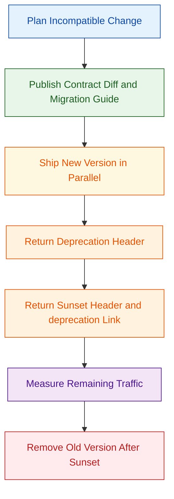

API versioning and API structuring define how a REST API evolves without breaking existing clients. Good design keeps URIs stable, HTTP semantics predictable, and change management explicit.

## What is it?

API versioning is the contract strategy for handling incompatible change over time. API structuring is the way resources, URIs, methods, representations, and error models are organized so clients can integrate safely and consistently [1], [2].

In practice, you design two things at once: the **resource model** (what your API exposes) and the **evolution model** (how it changes). Teams that treat both as first-class concerns usually avoid emergency rewrites and long-lived compatibility incidents [3], [4].

## Why do we need it? Where do we use it?

You need versioning and structure when clients and servers evolve independently. That is the default for public APIs, partner APIs, mobile backends, and internal platform APIs used by many teams [3], [5].

Typical reasons:

- Preserve backward compatibility for existing integrations while shipping new capabilities [3], [4].
- Make breaking changes deliberate, rare, and trackable with explicit migration windows [5], [11], [12].
- Keep operational behavior predictable for caching, monitoring, and incident response [1], [7].
- Keep API contracts readable and reviewable in OpenAPI artifacts and changelogs [14].

Common environments:

- Public SaaS APIs with third-party consumers.
- Enterprise integration APIs with strict change controls.
- Internal microservice ecosystems with independent deploy cadence.

## History Lesson

| When       | What                                                                                                              |
| ---------- | ----------------------------------------------------------------------------------------------------------------- |
| 2005       | RFC 3986 standardizes generic URI syntax, which remains foundational for resource naming [2].                     |
| 2012       | Semantic Versioning 2.0.0 formalizes MAJOR.MINOR.PATCH change semantics for compatibility communication [15].     |
| 2012       | RFC 6648 deprecates the `X-` naming convention for new protocol parameters and fields [16].                       |
| 2013       | RFC 6838 defines media type registration trees and naming procedures [8].                                         |
| 2013       | RFC 6839 formalizes structured syntax suffixes such as `+json` for media types [9].                               |
| 2017       | RFC 8288 standardizes the `Link` header model and link relation usage [13].                                       |
| 2019       | RFC 8594 introduces the `Sunset` response header for retirement signaling [12].                                   |
| 2022       | RFC 9110 and RFC 9111 consolidate modern HTTP semantics and caching behavior [1], [7].                            |
| 2022-11-28 | GitHub introduces date-based REST API versioning and documents a breaking-change policy with support windows [5]. |
| 2023       | RFC 9457 updates standardized machine-readable API error payloads (`application/problem+json`) [10].              |
| 2025       | RFC 9745 standardizes the `Deprecation` HTTP response header field [11].                                          |
| 2026-01-28 | Stripe documents `2026-01-28.clover` as the current API version (as observed on February 27, 2026) [6].           |

## Interaction with other topics?

- Authentication and authorization directly shape API versioning rollout, because token scopes and claims can change between API versions. See [OAuth 2.0](/kb/iam/authorization/oauth) and [Token-based Authentication](/kb/iam/authentication/token-authn).
- Requirements and contract language should define compatibility expectations before implementation. See [Requirements Engineering](/kb/misc/requirements-engineering).
- Domain boundaries influence resource granularity and URI shape. See [Domain Driven Design (DDD)](/kb/misc/ddd).

## How does it work?

A practical model is to keep one stable contract per major version and only ship additive changes inside that major line [3], [4], [5].

### Core design layers

1. **Resource layer**: model nouns (`/users`, `/orders/{orderId}`), not verbs [1], [2].
2. **Protocol layer**: use HTTP methods/status codes according to semantics and safety/idempotency expectations [1].
3. **Representation layer**: define media types and schema evolution rules (additive fields, enum growth, optionality) [8], [9], [14].
4. **Lifecycle layer**: deprecation notice, migration docs, sunset date, and final removal [11], [12], [13].

### Versioning strategy options

| Strategy              | Example                                                | Strengths                                                 | Trade-offs                                                 |
| --------------------- | ------------------------------------------------------ | --------------------------------------------------------- | ---------------------------------------------------------- |
| URI major version     | `/v1/orders/123`                                       | Very explicit, easy routing and metrics                   | Version in URI can spread quickly across links and clients |
| Header-based version  | `API-Version: 2026-01-01`                              | Keeps URIs stable                                         | Requires strict gateway/proxy handling and docs discipline |
| Media type versioning | `Accept: application/vnd.example.order+json;version=2` | Strong representation focus, good for content negotiation | More complex tooling and caching configuration             |
| Date-based versioning | `X-GitHub-Api-Version: 2022-11-28`                     | Easy lifecycle communication for rolling changes          | Requires strong changelog and release governance           |

### Compatibility rules that reduce breakage

- Prefer additive changes first: add optional fields, new endpoints, new enum values with tolerant clients [3], [4], [5].
- Never silently change existing field meaning, type, format, or requiredness in-place [3], [4].
- Define error payloads in one machine-readable format (`application/problem+json`) for all versions [10].
- If versioning is header/media-type based, return matching `Vary` headers so caches do not mix representations [1], [7].

### Deprecation and sunset lifecycle



Use the standards directly in responses:

- `Deprecation` header to signal deprecation date [11].
- `Sunset` header to signal expected retirement date [12].
- `Link: <...>; rel="deprecation"` for migration details [11], [13].

### Reference architecture (version-aware gateway)

```d2
direction: down

classes: {
  edge: {
    style: {
      stroke: "#0B5394"
      animated: true
    }
  }
  svc: {
    style: {
      fill: "#EAF2FF"
      stroke: "#1C4587"
      border-radius: 8
    }
  }
  warn: {
    style: {
      fill: "#FFF4E5"
      stroke: "#B45F06"
      border-radius: 8
    }
  }
}

client: API Clients
edge: API Gateway / Ingress {class: svc}
router: Version Router {class: svc}
v1: Orders API v1 {class: warn}
v2: Orders API v2 {class: svc}
policy: Deprecation & Sunset Policy {class: svc}
obs: Metrics / Logs / Alerts {class: svc}

client -> edge: HTTPS requests
edge -> router: Normalize headers and auth context
router -> v1: route legacy traffic
router -> v2: route current traffic
policy -> v1: Deprecation + Sunset headers
v1 -> obs: versioned telemetry
v2 -> obs: versioned telemetry
```

### Failure modes and error taxonomy

| Failure mode                                | Typical HTTP code              | Mitigation                                                                    |
| ------------------------------------------- | ------------------------------ | ----------------------------------------------------------------------------- |
| Unsupported version requested               | `400` or `406`                 | Return a problem detail with supported versions and migration link [5], [10]. |
| Mixed cache entries across versions         | `200` with wrong payload       | Configure `Vary` (`Accept`, `API-Version`, etc.) consistently [1], [7].       |
| Silent behavior drift in same major version | `2xx` but unexpected semantics | Enforce change review gates against compatibility rules [3], [4].             |
| Late migration beyond sunset                | `410`/`404` after removal      | Publish timeline early and expose deprecation headers for months [11], [12].  |

## Examples: Usage or Theory

### Example 1: URI major versioning with a stable error model

Prerequisites:

- You have a bearer token from your IdP.
- The API supports `/v1` and returns `application/problem+json` for errors [10].

```bash
$ set -euo pipefail
$ export API_BASE="https://api.example.com"
$ export TOKEN="<TOKEN>"
$ export ACCOUNT_ID="acc_123"
$ curl -sS "${API_BASE}/v1/accounts/${ACCOUNT_ID}" \
  -H "Authorization: Bearer ${TOKEN}" \
  -H "Accept: application/json"
```

Canonical success payload:

```json
{
  "id": "acc_123",
  "type": "account",
  "email": "student@example.edu",
  "created_at": "2026-02-20T10:11:12Z"
}
```

Canonical error payload:

```json
{
  "type": "https://api.example.com/problems/resource-not-found",
  "title": "Resource not found",
  "status": 404,
  "detail": "Account acc_123 was not found",
  "instance": "/v1/accounts/acc_123"
}
```

### Example 2: Media type versioning with cache-safe negotiation

```bash
$ set -euo pipefail
$ export API_BASE="https://api.example.com"
$ export TOKEN="<TOKEN>"
$ curl -i -sS "${API_BASE}/orders/ord_42" \
  -H "Authorization: Bearer ${TOKEN}" \
  -H "Accept: application/vnd.example.order+json;version=2"
```

Expected response headers (representative):

```http
HTTP/1.1 200 OK
Content-Type: application/vnd.example.order+json;version=2
Vary: Accept
Cache-Control: private, max-age=60
```

Why this matters: without `Vary: Accept`, shared caches can serve the wrong representation across versions [1], [7].

### Example 3: Deprecation and sunset signaling

```http
HTTP/1.1 200 OK
Content-Type: application/json
Deprecation: @1751327999
Sunset: Tue, 30 Sep 2026 23:59:59 GMT
Link: <https://developer.example.com/migrations/orders-v1-to-v2>; rel="deprecation"; type="text/html"
```

This response tells clients that the resource is deprecated, when retirement is expected, and where migration guidance lives [11], [12], [13].

### Example 4: Minimal migration runbook (provider side)

1. Define incompatible change and target major/date version.
2. Publish changelog + migration guide before rollout.
3. Run both versions in parallel and emit `Deprecation` and `Sunset` headers.
4. Track version-specific traffic and error rates.
5. Freeze new consumers on old version.
6. Remove old version only after migration SLO is met.

## References and further reading

[1] R. Fielding, M. Nottingham, and J. Reschke, "HTTP Semantics," RFC 9110, Jun. 2022. [Online]. Available: https://www.rfc-editor.org/rfc/rfc9110

[2] T. Berners-Lee, R. Fielding, and L. Masinter, "Uniform Resource Identifier (URI): Generic Syntax," RFC 3986, Jan. 2005. [Online]. Available: https://www.rfc-editor.org/rfc/rfc3986

[3] Google, "AIP-180: Backwards compatibility." Accessed: Feb. 27, 2026. [Online]. Available: https://google.aip.dev/180

[4] Google, "AIP-185: API Versioning." Accessed: Feb. 27, 2026. [Online]. Available: https://google.aip.dev/185

[5] GitHub Docs, "API versions." Accessed: Feb. 27, 2026. [Online]. Available: https://docs.github.com/rest/overview/api-versions

[6] Stripe Docs, "Versioning." Accessed: Feb. 27, 2026. [Online]. Available: https://docs.stripe.com/api/versioning

[7] R. Fielding, M. Nottingham, and J. Reschke, "HTTP Caching," RFC 9111, Jun. 2022. [Online]. Available: https://www.rfc-editor.org/rfc/rfc9111

[8] N. Freed, J. Klensin, and T. Hansen, "Media Type Specifications and Registration Procedures," RFC 6838, Jan. 2013. [Online]. Available: https://www.rfc-editor.org/rfc/rfc6838

[9] T. Hansen and A. Melnikov, "Additional Media Type Structured Syntax Suffixes," RFC 6839, Jan. 2013. [Online]. Available: https://www.rfc-editor.org/rfc/rfc6839

[10] M. Nottingham, E. Wilde, and S. Dalal, "Problem Details for HTTP APIs," RFC 9457, Jul. 2023. [Online]. Available: https://www.rfc-editor.org/rfc/rfc9457

[11] S. Dalal and E. Wilde, "The Deprecation HTTP Response Header Field," RFC 9745, Mar. 2025. [Online]. Available: https://www.rfc-editor.org/rfc/rfc9745

[12] E. Wilde, "The Sunset HTTP Header Field," RFC 8594, May 2019. [Online]. Available: https://www.rfc-editor.org/rfc/rfc8594

[13] M. Nottingham, "Web Linking," RFC 8288, Oct. 2017. [Online]. Available: https://www.rfc-editor.org/rfc/rfc8288

[14] OpenAPI Initiative, "OpenAPI Specification v3.1.1," Oct. 24, 2024. [Online]. Available: https://spec.openapis.org/oas/v3.1.1.html

[15] T. Preston-Werner et al., "Semantic Versioning 2.0.0." Accessed: Feb. 27, 2026. [Online]. Available: https://semver.org/

[16] P. Saint-Andre, D. Crocker, and M. Nottingham, "Deprecating the \"X-\" Prefix and Similar Constructs in Application Protocols," BCP 178, RFC 6648, Jun. 2012. [Online]. Available: https://www.rfc-editor.org/rfc/rfc6648
