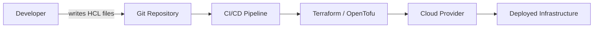
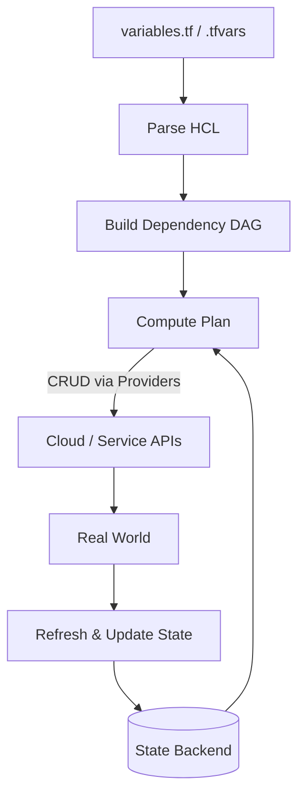

## What is it?

Terraform (and its community-driven fork, **OpenTofu**) is an **Infrastructure as Code (IaC)** tool.  
It allows you to **define, provision, and manage cloud infrastructure** using simple, declarative configuration files written in **HCL (HashiCorp Configuration Language)**.  
Instead of clicking through cloud dashboards, you describe your infrastructure in text files — which makes it **versionable, reproducible, and automatable**.

OpenTofu is a **fully open-source fork** of Terraform, created after HashiCorp changed Terraform’s license from the Mozilla Public License (MPL) to the Business Source License (BUSL) in 2023.

👉 Think of Terraform/OpenTofu as the _programming toolchain for your cloud infrastructure._

## Why do we need it? Where do we use it?

Managing modern infrastructure manually is hard.
You have VMs, networks, databases, load balancers… all living in different cloud providers.  
Terraform/OpenTofu helps by providing:

- **Automation:** You write your desired state once, and Terraform makes it happen.
- **Version control:** Infrastructure configurations can live in Git, just like code.
- **Reproducibility:** Deploy the same setup across environments (dev, staging, prod).
- **Multi-cloud support:** Works with AWS, Azure, GCP, Kubernetes, and many others.

You’ll find Terraform/OpenTofu used in:

- **DevOps pipelines** (e.g., automated infrastructure provisioning in CI/CD)
- **Cloud migrations**
- **Kubernetes cluster setups**
- **Self-service infrastructure portals**

## History Lesson

| Year               | Event                     | Description                                                                                                       |
| ------------------ | ------------------------- | ----------------------------------------------------------------------------------------------------------------- |
| **2014**           | Terraform v0.1 released   | HashiCorp introduces Terraform as an open-source IaC tool under the MPL 2.0 license.                              |
| **2017–2020**      | Growth & ecosystem boom   | Terraform gains popularity, adding providers for AWS, Azure, GCP, and others. IaC becomes a DevOps standard.      |
| **2021**           | Terraform 1.0 released 🎉 | Marks Terraform as stable for production use; backward compatibility guaranteed.                                  |
| **August 2023**    | License change            | HashiCorp switches from MPL to BUSL, sparking community concern about open-source freedom.                        |
| **September 2023** | OpenTofu announced        | Linux Foundation and community launch OpenTofu as a fork of Terraform, fully open source and Apache 2.0 licensed. |
| **2024+**          | Parallel development      | Terraform and OpenTofu continue as separate projects, mostly compatible but independently maintained.             |

## Interaction with other topics?

Terraform/OpenTofu sits at the intersection of several key areas:

- **CI/CD pipelines:** Integrates with tools like GitHub Actions, GitLab CI, Jenkins, etc.
- **Configuration management:** Complements tools like Ansible, Puppet, or Chef (Terraform provisions infra, Ansible configures it).
- **Cloud providers:** Interacts with AWS, Azure, GCP, etc., via _providers_ (plugins).
- **Secrets management:** Works with Vault, AWS Secrets Manager, etc.
- **Containers & Kubernetes:** You can define clusters and services declaratively.

Here’s how Terraform fits in a DevOps workflow:



## How does it work?

Terraform/OpenTofu follows a **plan → apply → destroy** workflow, powered by a few core building blocks.

### The main components

- **HCL (HashiCorp Configuration Language):** The declarative language you write in `.tf` files.
  You describe the desired state (resources, their arguments, and relationships).
  HCL also supports expressions, variables, `for_each`, `count`, and conditionals.
- **CLI binary (`terraform` or `tofu`):** The command‑line engine that parses HCL, builds a dependency graph, proposes a plan, and executes it.
  It also talks to backends for remote state and to providers for CRUD operations.
- **Providers:** Plug‑in shims that translate resource operations into **API calls** against real systems (AWS, Azure, GCP, Kubernetes, databases, SaaS, etc.).
  Providers expose **resources** and **data sources**.
- **Backends / State storage:** Where the state file lives (local, S3+DynamoDB, GCS, AzureRM, Terraform Cloud, etc.).
  Backends also provide locking to avoid concurrent writes.
- **Remote APIs:** The actual cloud/service endpoints that create VMs, buckets, networks, etc.
  Providers handle authentication, rate limiting, retries, and API nuances on your behalf.

### The dependency graph (DAG)

Internally, Terraform represents your configuration as a **Directed Acyclic Graph (DAG)** of nodes:

- Nodes are resources, modules, data sources, and provisioners.
- Edges are dependencies inferred from references (e.g., `aws_subnet.app` needs `aws_vpc.main.id`).
- During **plan/apply**, Terraform performs a **topological sort** of this DAG so that independent nodes can run in parallel, while dependent nodes wait. This is why you often see multiple resources being created concurrently.



### HCL, state, and the real world

1. **Read & Refresh:** When you run `plan`, Terraform reads your **state** and **refreshes** it by querying providers (unless you disable refresh).
   This detects **drift** (differences between state and reality).
2. **Diff:** Terraform compares refreshed state to the **desired state** from HCL, producing an execution **plan** (`+ create`, `~ update in‑place`, `- destroy`, `-/+ replace`).
3. **Apply:** Terraform executes provider operations to reconcile reality with your HCL.
   On success, it **persists** the new state atomically in the backend (with a lock if supported).

> 💡 **Tip:** If state is remote (e.g., S3 + DynamoDB lock or Terraform Cloud), teams avoid conflicts and get reliable locking and history.

### Modules - composition and reuse

- A **module** is just a directory of `.tf` files.
  The root of your repo is the **root module**; any `module` blocks you call are **child modules**.
- Modules expose **input variables** and **outputs** and are versioned (e.g., `version = "~> 2.3"`).
- You can source modules **locally**, from the **Terraform/Tofu Registry**, a **Git repo**, or private registries.
- Modules enable **abstraction** (hide provider details), **consistency** (same patterns across environments), and **composition** (stack modules together).

```hcl
module "network" {
  source  = "git::https://example.com/infra/network.git?ref=v2.3.1"
  cidr    = var.vpc_cidr
  az_count = 3
}

module "app" {
  source       = "./modules/app"
  image_tag    = var.image_tag
  subnet_ids   = module.network.private_subnet_ids
}
```

### Services like Terraform Cloud

Managed services (e.g., **Terraform Cloud/Enterprise**) improve the IaC workflow by providing:

- **Remote state + locking** out of the box (no DIY S3/GCS + DynamoDB).
- **VCS‑driven runs**: automatically run plan/apply on PRs with run logs and approvals.
- **RBAC & workspaces**: isolate environments, manage permissions, audit trails.
- **Secure variable storage**: store secrets/workspace vars (masked in logs).
- **Policies** (e.g., Sentinel/Open Policy Agent): enforce guardrails before apply.
- **Run consistency**: plans happen in consistent, ephemeral runners; no “works on my laptop.”
- **Cost estimates & drift detection** (where supported): preview spend and detect config drift.

You can get many of these benefits self‑hosted with alternative backends (e.g., S3+lock, Atlantis for VCS‑driven plans, OPA for policy), but managed platforms reduce glue work and operational burden.

## Examples: Usage or Theory

### Common Terraform / OpenTofu commands

| Command     | What it does                                                                    | Example                                            |
| ----------- | ------------------------------------------------------------------------------- | -------------------------------------------------- |
| `init`      | Initialize a working directory, download providers & modules, configure backend | `terraform init -upgrade`                          |
| `validate`  | Check configuration is syntactically valid and internally consistent            | `terraform validate`                               |
| `fmt`       | Reformat HCL files to canonical style                                           | `terraform fmt -recursive`                         |
| `providers` | Show required and installed providers                                           | `terraform providers`                              |
| `graph`     | Output the execution DAG (great for learning/debugging)                         | `terraform graph > graph.dot`                      |
| `plan`      | Create an execution plan (no changes)                                           | `terraform plan -var-file=prod.tfvars`             |
| `apply`     | Apply changes (reconciles to desired state)                                     | `terraform apply -auto-approve`                    |
| `destroy`   | Destroy managed infrastructure                                                  | `terraform destroy -target=aws_s3_bucket.example`  |
| `output`    | Show root module outputs                                                        | `terraform output -json`                           |
| `show`      | Inspect state or plan files                                                     | `terraform show` or `terraform show plan.out`      |
| `state`     | Low‑level state operations (list, rm, mv)                                       | `terraform state list`                             |
| `import`    | Adopt existing resources into state                                             | `terraform import aws_s3_bucket.example my-bucket` |
| Workspaces  | Manage multiple logical environments in one config                              | `terraform workspace new staging`                  |
| Login       | Authenticate to Terraform Cloud/Enterprise                                      | `terraform login`                                  |

> 🧪 **Modern replacement:** Instead of the old `taint` command, use `plan -replace` / `apply -replace`. Example: `terraform apply -replace=aws_instance.web`.

#### Example: rendering the DAG

```bash
terraform graph | dot -Tpng > dag.png
```

#### Example: OpenTofu parity

Everything above works similarly with OpenTofu. Replace `terraform` with `tofu`:

```bash
tofu init && tofu plan && tofu apply
```

## References and Further Reading

- [Terraform Documentation](https://developer.hashicorp.com/terraform/docs)
- [OpenTofu Documentation](https://opentofu.org/docs/)
- [HashiCorp Blog](https://www.hashicorp.com/blog)
- [OpenTofu GitHub Repo](https://github.com/opentofu/opentofu)
- [Introduction to Infrastructure as Code (IaC)](https://learn.microsoft.com/en-us/devops/deliver/what-is-infrastructure-as-code)
- [Terratest: Automated testing for Terraform](https://terratest.gruntwork.io/)
