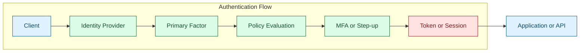
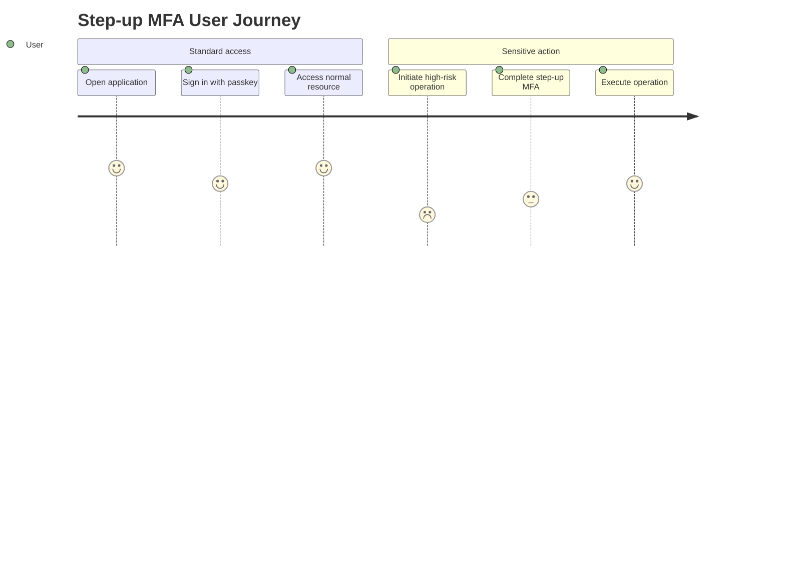

Authentication answers one question: is the requester really the claimed identity? Multi-Factor Authentication (MFA) improves this assurance by requiring at least two independent factors, reducing account-takeover risk in real-world threat conditions [1], [2].

## What is it?

Authentication is the process of establishing trust in a digital identity. NIST defines a structured model for authenticator types, assurance levels, and lifecycle handling of credentials and sessions [1].

MFA combines at least two factor categories [1]:

- `Knowledge`: something you know (password, PIN)
- `Possession`: something you have (security key, OTP device)
- `Inherence`: something you are (biometric factor)

## Why do we need it? Where do we use it?

Single-factor login, especially password-only login, is frequently inadequate for modern attack patterns. MFA significantly improves resistance to credential stuffing and phishing, especially when phishing-resistant methods (for example FIDO2/WebAuthn) are used [1], [2], [3].

Typical deployment areas:

- Workforce SSO for business applications
- Privileged administrator and break-glass access
- VPN, bastion hosts, cloud control planes
- Customer systems with sensitive data or transaction risk

## History Lesson

| When | What                                                        |
| ---- | ----------------------------------------------------------- |
| 2005 | HOTP is standardized in RFC 4226 [4].                       |
| 2011 | TOTP is standardized in RFC 6238 [5].                       |
| 2014 | OIDC 1.0 standardizes web identity federation [6].          |
| 2019 | WebAuthn Level 1 becomes W3C Recommendation [2].            |
| 2021 | WebAuthn Level 2 becomes W3C Recommendation [3].            |
| 2025 | NIST SP 800-63B updates authenticator and MFA guidance [1]. |

## Interaction with other topics?

- **Identity and IdP**: AuthN depends on identity lifecycle and trust anchors (`../identities-idp.md`).
- **SAML/OIDC**: protocol layers transport AuthN outcomes to relying systems (`saml.md`, `oidc.md`).
- **Authorization**: authorization quality depends on authentication quality (`../authorization/index.md`).

## How does it work?

A common authentication flow:

1. Client starts login at the IdP.
2. Primary factor is verified.
3. Policy decides whether MFA or step-up MFA is required.
4. IdP issues a session and/or token.
5. Target system validates trust artifacts and enforces access.





## Examples: Usage or Theory

### Example 1: Select authentication by risk level

| Risk tier | Recommended method                                  |
| --------- | --------------------------------------------------- |
| Low       | OIDC + password with optional TOTP                  |
| Medium    | OIDC + mandatory MFA                                |
| High      | OIDC/SAML + phishing-resistant MFA (FIDO2/WebAuthn) |

### Example 2: Step-up policy pseudo-logic

```text
if action in {"delete-production", "rotate-kms-key", "approve-payment"}:
    require_phishing_resistant_mfa()
else:
    allow_with_current_session()
```

## References and further reading

[1] NIST, "SP 800-63B - Authentication and Authenticator Management." Accessed: Feb. 21, 2026. [Online]. Available: https://pages.nist.gov/800-63-4/sp800-63b.html

[2] W3C, "Web Authentication: An API for accessing Public Key Credentials Level 1," Mar. 2019. [Online]. Available: https://www.w3.org/TR/webauthn/

[3] W3C, "Web Authentication: An API for accessing Public Key Credentials Level 2," Apr. 2021. [Online]. Available: https://www.w3.org/TR/webauthn-2/

[4] D. M'Raihi et al., "HOTP: An HMAC-Based One-Time Password Algorithm," RFC 4226, Dec. 2005. [Online]. Available: https://www.rfc-editor.org/rfc/rfc4226

[5] D. M'Raihi et al., "TOTP: Time-Based One-Time Password Algorithm," RFC 6238, May 2011. [Online]. Available: https://www.rfc-editor.org/rfc/rfc6238

[6] OpenID Foundation, "OpenID Connect Core 1.0 incorporating errata set 2," Dec. 2023. [Online]. Available: https://openid.net/specs/openid-connect-core-1_0.html
