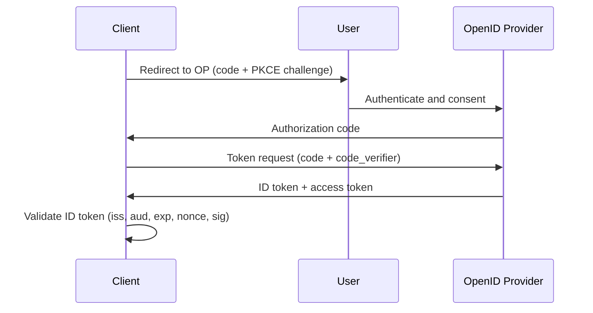

OIDC is an identity layer built on top of OAuth 2.0. It standardizes how clients verify end-user identity and retrieve profile claims, which makes it a primary protocol for modern web and mobile SSO [1], [2].

## What is it?

OIDC extends OAuth with identity-focused artifacts such as the `ID Token`, `UserInfo` endpoint, and discovery metadata [1], [2]. This transforms OAuth mechanics from pure delegation into interoperable authentication and federation.

Key OIDC building blocks [1], [2], [3]:

- `ID Token`: signed JWT containing authentication claims
- `UserInfo endpoint`: additional standardized claims
- Discovery document: `/.well-known/openid-configuration`
- `JWKS`: key set used for signature validation

## Why do we need it? Where do we use it?

OIDC reduces integration friction by giving clients predictable endpoints, claim formats, and validation semantics. Combined with Authorization Code + PKCE, it is a robust baseline for browser and mobile applications [1], [4], [5].

Common usage areas:

- Enterprise and customer-facing web SSO
- Mobile application login
- Partner federation scenarios
- API platforms requiring standardized identity context

## History Lesson

| When | What                                                              |
| ---- | ----------------------------------------------------------------- |
| 2012 | OAuth 2.0 (RFC 6749) establishes the base framework [6].          |
| 2014 | OIDC 1.0 is finalized [1].                                        |
| 2015 | PKCE (RFC 7636) is standardized to protect public clients [4].    |
| 2023 | OIDC core is consolidated with errata set 2 [1].                  |
| 2025 | OAuth 2.0 Security BCP (RFC 9700) updates security practices [5]. |

## Interaction with other topics?

- **OAuth**: OIDC depends on OAuth token and authorization mechanics (`../authorization/oauth.md`).
- **Token AuthN**: ID and access token validation is operationally critical (`token-authn.md`).
- **MFA**: MFA policy is enforced at the IdP during the authentication event (`index.md`).

## How does it work?

Recommended flow: Authorization Code with PKCE.

1. Client redirects user to authorization endpoint.
2. User authenticates at the provider.
3. Client receives an authorization code.
4. Client exchanges code + verifier for tokens.
5. Client validates ID token claims and signature.



## Examples: Usage or Theory

### Example 1: Query OIDC discovery metadata

Prerequisite: issuer URL published by your IdP.

```bash
$ set -euo pipefail
$ export OIDC_ISSUER="https://idp.example.com/realms/demo"
$ curl -sS "${OIDC_ISSUER}/.well-known/openid-configuration"
```

Canonical response shape:

```json
{
  "issuer": "https://idp.example.com/realms/demo",
  "authorization_endpoint": "https://idp.example.com/realms/demo/protocol/openid-connect/auth",
  "token_endpoint": "https://idp.example.com/realms/demo/protocol/openid-connect/token",
  "jwks_uri": "https://idp.example.com/realms/demo/protocol/openid-connect/certs"
}
```

Canonical error response shape (misconfigured issuer):

```json
{
  "error": "invalid_request",
  "error_description": "Issuer not found"
}
```

### Example 2: Minimal ID token validation checklist

```text
1) Validate signature using JWKS
2) Verify iss equals expected issuer
3) Verify aud contains the client_id
4) Verify exp/nbf are within valid time window
5) Verify nonce matches login transaction state
```

## References and further reading

[1] OpenID Foundation, "OpenID Connect Core 1.0 incorporating errata set 2," Dec. 2023. [Online]. Available: https://openid.net/specs/openid-connect-core-1_0.html

[2] OpenID Foundation, "OpenID Connect Discovery 1.0 incorporating errata set 2," Dec. 2023. [Online]. Available: https://openid.net/specs/openid-connect-discovery-1_0.html

[3] M. Jones et al., "JSON Web Token (JWT)," RFC 7519, May 2015. [Online]. Available: https://www.rfc-editor.org/rfc/rfc7519

[4] N. Sakimura et al., "Proof Key for Code Exchange by OAuth Public Clients," RFC 7636, Sep. 2015. [Online]. Available: https://www.rfc-editor.org/rfc/rfc7636

[5] D. Fett, B. Campbell, and J. Bradley, "Best Current Practice for OAuth 2.0 Security," RFC 9700, Jan. 2025. [Online]. Available: https://www.rfc-editor.org/rfc/rfc9700

[6] D. Hardt, "The OAuth 2.0 Authorization Framework," RFC 6749, Oct. 2012. [Online]. Available: https://www.rfc-editor.org/rfc/rfc6749
