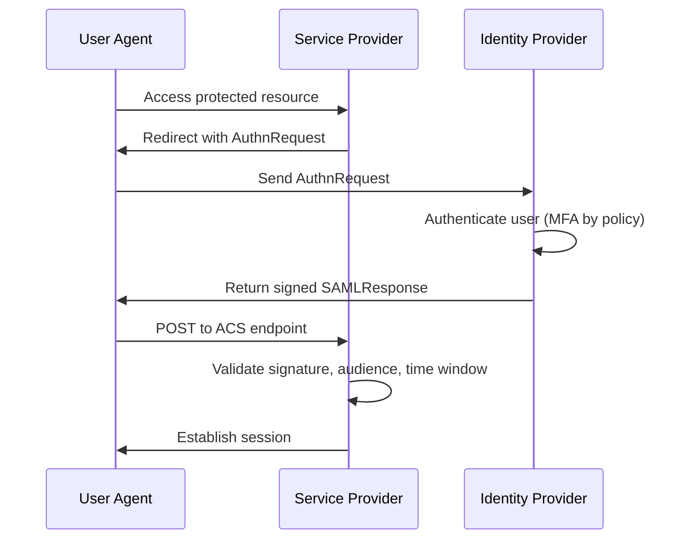

SAML is an XML-based federation standard for web SSO between an Identity Provider (IdP) and a Service Provider (SP). It remains common in enterprise environments with large SaaS portfolios, established compliance controls, and legacy integrations [1], [2].

## What is it?

SAML 2.0 defines how authentication and attribute data are exchanged as signed assertions between trusted parties [2], [3], [4]. A user typically authenticates at the IdP, and the SP consumes the resulting assertion to establish a local session.

Core SAML components [2], [3]:

- `Assertion`: contains authentication and attribute statements
- `Protocol`: request/response structures such as `AuthnRequest`
- `Bindings`: transport options such as HTTP Redirect and POST
- `Profiles`: integration patterns such as Web Browser SSO

## Why do we need it? Where do we use it?

SAML is strong when organizations need centralized federation for many business applications, often with strict trust management and metadata-driven configuration [1], [2].

Common usage areas:

- Enterprise workforce SSO
- Integration of legacy enterprise applications
- B2B federation between organizations

## History Lesson

| When | What                                                                           |
| ---- | ------------------------------------------------------------------------------ |
| 2005 | SAML 2.0 core, bindings, and profiles are standardized by OASIS [2], [3], [4]. |
| 2008 | OASIS publishes a practical SAML 2.0 technical overview [1].                   |
| 2025 | NIST SP 800-63C updates federation guidance relevant to SAML deployments [5].  |

## Interaction with other topics?

- **Identities and IdP**: SAML relies on robust identity lifecycle and trust config (`../identities-idp.md`).
- **MFA**: MFA enforcement is usually policy-controlled at the IdP (`index.md`).
- **Authorization**: SAML attributes are often mapped into local RBAC policies (`../authorization/rbac-abac.md`).

## How does it work?

Typical SP-initiated SSO sequence:

1. User accesses the SP.
2. SP redirects with an `AuthnRequest`.
3. IdP authenticates the user.
4. IdP returns signed `SAMLResponse` with assertion.
5. SP validates trust conditions and creates a local session.



Critical SP-side security checks [2], [3], [5]:

- Signature validation against trusted IdP certificates
- Strict `Audience` and ACS URL validation
- Tight assertion lifetime checks (`NotBefore`, `NotOnOrAfter`)
- Replay protections and request correlation where supported

## Examples: Usage or Theory

### Example 1: Minimal AuthnRequest snippet

```xml
<samlp:AuthnRequest
  xmlns:samlp="urn:oasis:names:tc:SAML:2.0:protocol"
  ID="_abc123"
  Version="2.0"
  IssueInstant="2026-02-21T10:00:00Z"
  Destination="https://idp.example.com/sso"
  AssertionConsumerServiceURL="https://app.example.com/saml/acs">
  <saml:Issuer xmlns:saml="urn:oasis:names:tc:SAML:2.0:assertion">
    https://app.example.com
  </saml:Issuer>
</samlp:AuthnRequest>
```

### Example 2: Operational checklist for stable SAML integrations

- Version SP/IdP metadata and monitor certificate expiration.
- Test certificate rotation before production cutover.
- Keep assertion lifetime short and time sync reliable.
- Document attribute mapping contract per application.

## References and further reading

[1] OASIS, "Security Assertion Markup Language (SAML) V2.0 Technical Overview," Mar. 2008. [Online]. Available: https://docs.oasis-open.org/security/saml/Post2.0/sstc-saml-tech-overview-2.0.pdf

[2] OASIS, "Assertions and Protocols for the OASIS Security Assertion Markup Language (SAML) V2.0," Mar. 2005. [Online]. Available: https://docs.oasis-open.org/security/saml/v2.0/saml-core-2.0-os.pdf

[3] OASIS, "Bindings for the OASIS Security Assertion Markup Language (SAML) V2.0," Mar. 2005. [Online]. Available: https://docs.oasis-open.org/security/saml/v2.0/saml-bindings-2.0-os.pdf

[4] OASIS, "Profiles for the OASIS Security Assertion Markup Language (SAML) V2.0," Mar. 2005. [Online]. Available: https://docs.oasis-open.org/security/saml/v2.0/saml-profiles-2.0-os.pdf

[5] NIST, "SP 800-63C - Federation and Assertions." Accessed: Feb. 21, 2026. [Online]. Available: https://pages.nist.gov/800-63-4/sp800-63c.html
