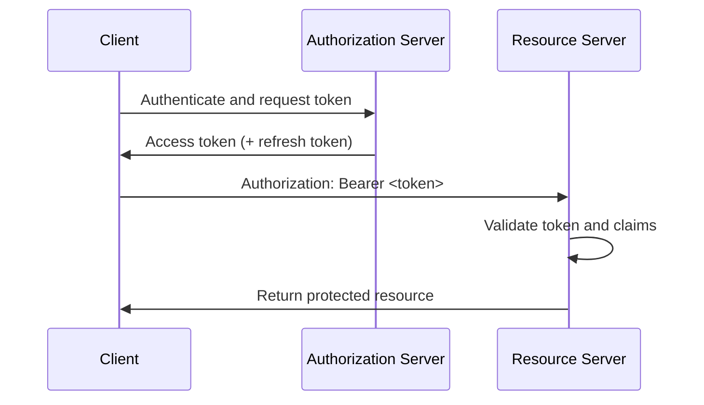

In token-based authentication, clients do not send primary credentials on every request. Instead, they present previously issued tokens, which improves scalability for APIs and distributed systems when validation, expiration, and revocation are implemented correctly [1], [2], [3].

## What is it?

A token is a credential artifact issued after successful authentication. In API systems, bearer tokens in the `Authorization` header are the most common pattern [1].

Common token types:

- `Opaque token`: validated via introspection or lookup [4]
- `JWT`: self-contained token with claims and signature [2]
- `Refresh token`: used to obtain new access tokens [5]

## Why do we need it? Where do we use it?

Tokens reduce direct exposure of primary credentials and enable better scope isolation, short lifetimes, and delegated access flows [1], [5].

Typical usage areas:

- Frontend-to-backend API access
- Service-to-service calls in distributed systems
- CLI and automation access to platform APIs
- Federation systems using OIDC/OAuth

## History Lesson

| When | What                                                                    |
| ---- | ----------------------------------------------------------------------- |
| 2012 | Bearer token usage is standardized in RFC 6750 [1].                     |
| 2012 | OAuth 2.0 defines token issuance and grant models [5].                  |
| 2015 | JWT is standardized in RFC 7519 [2].                                    |
| 2015 | OAuth token introspection is standardized in RFC 7662 [4].              |
| 2025 | OAuth 2.0 Security BCP (RFC 9700) updates token security practices [3]. |

## Interaction with other topics?

- **OIDC**: ID and access tokens are central protocol artifacts (`oidc.md`).
- **OAuth**: OAuth defines issuance and delegation semantics (`../authorization/oauth.md`).
- **Authorization**: scopes and claims feed policy decisions.

## How does it work?

Typical token flow for API access:

1. Client authenticates to an authorization server.
2. Authorization server issues access token (optionally refresh token).
3. Client includes token in API requests.
4. Resource server validates token trust conditions.



Operational security baseline [1], [2], [3]:

- Enforce TLS for all token transport.
- Keep access token lifetime short.
- Validate `iss`, `aud`, `exp`, and signature strictly.
- Implement key rotation and revocation strategy.
- Never place bearer tokens in URL query parameters.

## Examples: Usage or Theory

### Example 1: Bearer token API request

```bash
$ set -euo pipefail
$ export API_URL="https://api.example.com/v1/projects"
$ export ACCESS_TOKEN="<ACCESS_TOKEN>"
$ curl -sS "${API_URL}" \
  -H "Authorization: Bearer ${ACCESS_TOKEN}"
```

Canonical success response shape:

```json
{
  "items": [{ "id": "p-001", "name": "project-alpha" }]
}
```

Canonical error response shape:

```json
{
  "error": "invalid_token",
  "error_description": "The access token expired"
}
```

### Example 2: JWT access token validation checklist

```text
1) Validate signature using issuer JWKS
2) Verify expected issuer (iss)
3) Verify expected audience (aud)
4) Verify token lifetime (exp/nbf)
5) Evaluate scope/role claims against endpoint policy
```

## References and further reading

[1] M. Jones and D. Hardt, "The OAuth 2.0 Authorization Framework: Bearer Token Usage," RFC 6750, Oct. 2012. [Online]. Available: https://www.rfc-editor.org/rfc/rfc6750

[2] M. Jones et al., "JSON Web Token (JWT)," RFC 7519, May 2015. [Online]. Available: https://www.rfc-editor.org/rfc/rfc7519

[3] D. Fett, B. Campbell, and J. Bradley, "Best Current Practice for OAuth 2.0 Security," RFC 9700, Jan. 2025. [Online]. Available: https://www.rfc-editor.org/rfc/rfc9700

[4] J. Richer, "OAuth 2.0 Token Introspection," RFC 7662, Oct. 2015. [Online]. Available: https://www.rfc-editor.org/rfc/rfc7662

[5] D. Hardt, "The OAuth 2.0 Authorization Framework," RFC 6749, Oct. 2012. [Online]. Available: https://www.rfc-editor.org/rfc/rfc6749
