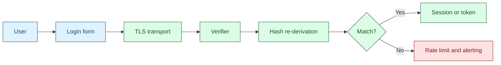

Username and password remains the most widely deployed authentication pattern, but it is also one of the most frequently attacked. In modern IAM, it should be treated as one factor in a broader MFA strategy, not as a standalone control [1], [2].

## What is it?

This method verifies identity using a claimed identifier and a memorized secret. Verifiers compare the submitted secret against a secure stored representation (never plaintext), typically using salted password hashing and controlled verification logic [1].

Key terms:

- `Verifier`: component validating the authenticator [1]
- `Memorized secret`: NIST term for passwords/PINs [1]
- `Password hash`: one-way derived value with salt and work factor

## Why do we need it? Where do we use it?

Password-based authentication remains common because it is universal, low-friction, and broadly supported. It is still practical when combined with MFA and strong operational controls [1].

Typical usage areas:

- Workforce login with MFA
- Backup authentication when stronger factors are unavailable
- Legacy systems that cannot support modern authenticators directly

## History Lesson

| When | What                                                                    |
| ---- | ----------------------------------------------------------------------- |
| 2011 | TOTP (RFC 6238) enables practical password + OTP MFA deployments [3].   |
| 2015 | HTTP Basic is formalized in RFC 7617 [2].                               |
| 2021 | Argon2 guidance is standardized in RFC 9106 [4].                        |
| 2025 | NIST SP 800-63B updates password and authenticator recommendations [1]. |

## Interaction with other topics?

- **MFA**: password-only is insufficient for higher-risk contexts (`index.md`).
- **Token AuthN**: successful login typically results in session cookies or tokens (`token-authn.md`).
- **Authorization**: passwords identify the subject, but do not define permissions.

## How does it work?

Typical secure flow:

1. User submits username and password over TLS.
2. Verifier fetches credential record (salt/hash/parameters).
3. Password is re-derived and compared in constant-time logic.
4. On success, session/token issuance proceeds.
5. Failed attempts trigger rate control and monitoring.



NIST-aligned recommendations [1]:

- Prefer length and breached-password checks over rigid composition rules.
- Avoid unnecessary forced periodic rotation.
- Enforce MFA for privileged and high-risk actions.
- Protect recovery flows with the same rigor as login flows.

## Examples: Usage or Theory

### Example 1: HTTP Basic request (only over TLS)

```bash
$ set -euo pipefail
$ export API_URL="https://api.example.com/v1/health"
$ export API_USER="demo"
$ export API_PASSWORD="<PASSWORD>"
$ curl -sS -u "${API_USER}:${API_PASSWORD}" "${API_URL}"
```

Canonical success response shape:

```json
{
  "status": "ok",
  "service": "identity-api"
}
```

Canonical error response shape:

```json
{
  "error": "unauthorized",
  "message": "invalid credentials"
}
```

### Example 2: Practical password policy baseline

| Control          | Recommendation                            |
| ---------------- | ----------------------------------------- |
| Length           | Enforce meaningful minimum length         |
| Storage          | Salted, memory-hard hashing               |
| Failure handling | Progressive delays and lockout protection |
| Recovery         | Strong, audited account recovery flow     |

## References and further reading

[1] NIST, "SP 800-63B - Authentication and Authenticator Management." Accessed: Feb. 21, 2026. [Online]. Available: https://pages.nist.gov/800-63-4/sp800-63b.html

[2] J. Reschke, "The 'Basic' HTTP Authentication Scheme," RFC 7617, Sep. 2015. [Online]. Available: https://www.rfc-editor.org/rfc/rfc7617

[3] D. M'Raihi et al., "TOTP: Time-Based One-Time Password Algorithm," RFC 6238, May 2011. [Online]. Available: https://www.rfc-editor.org/rfc/rfc6238

[4] A. Biryukov, D. Dinu, and D. Khovratovich, "Argon2 Memory-Hard Function for Password Hashing and Proof-of-Work Applications," RFC 9106, Sep. 2021. [Online]. Available: https://www.rfc-editor.org/rfc/rfc9106
