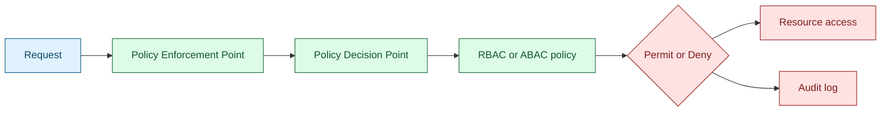

Authorization determines which actions an authenticated identity may execute on a resource. In operational IAM terms, this is where security policy becomes enforcement: access is either permitted or denied based on explicit rules [1], [2], [3].

## What is it?

Authorization evaluates `Subject`, `Action`, `Resource`, and optionally `Context`. Common models include RBAC (role-based), ABAC (attribute-based), and delegated patterns enabled by OAuth scopes and claims [1], [2], [3].

Separation of concerns is mandatory:

- Authentication: confirms identity
- Authorization: determines allowed behavior

## Why do we need it? Where do we use it?

Without explicit authorization control, systems drift into over-privilege and weak separation of duties. Strong authorization supports least privilege, governance, and auditable decision trails [1], [2].

Typical implementation areas:

- Role models in SaaS and enterprise applications
- API access control via scopes and claims
- Kubernetes, SCM, CI/CD, and data platform access
- Compliance-sensitive systems with recertification requirements

## History Lesson

| When | What                                                |
| ---- | --------------------------------------------------- |
| 2000 | NIST consolidates RBAC into a unified model [1].    |
| 2012 | OAuth 2.0 standardizes delegated authorization [3]. |
| 2014 | NIST SP 800-162 formalizes ABAC guidance [2].       |
| 2025 | RFC 9700 updates OAuth security practices [4].      |

## Interaction with other topics?

- **Identities and groups** provide subject data for policy evaluation (`../identities-idp.md`).
- **Authentication** provides trusted identity context (`../authentication/index.md`).
- **OAuth** provides delegated authorization artifacts (`oauth.md`).
- **RBAC/ABAC** define the policy logic shape (`rbac-abac.md`).

## How does it work?

A robust implementation separates decision and enforcement:

1. Request reaches an enforcement point.
2. Context is collected (subject, action, resource, environment).
3. Decision engine evaluates policy.
4. Permit or deny is enforced.
5. Decision and context are logged for audit.



## Examples: Usage or Theory

### Example 1: Environment-aware role mapping

| Group                 | DEV         | TEST         | PROD         |
| --------------------- | ----------- | ------------ | ------------ |
| `project-x-engineers` | `admin`     | `maintainer` | `read-only`  |
| `platform-team`       | `admin`     | `admin`      | `maintainer` |
| `management`          | `read-only` | `read-only`  | `read-only`  |

This model is practical when role definitions remain global, and environment differences are expressed in assignment mappings.

### Example 2: Deny-by-default baseline

```text
if no policy rule matches:
    deny
```

Deny-by-default prevents accidental exposure caused by incomplete rule sets.

## References and further reading

[1] R. Sandhu, D. Ferraiolo, and R. Kuhn, "The NIST Model for Role-Based Access Control," NIST, Jul. 2000. [Online]. Available: https://www.nist.gov/publications/nist-model-role-based-access-control-towards-unified-standard

[2] V. C. Hu et al., "Guide to Attribute Based Access Control (ABAC)," NIST SP 800-162, Jan. 2014. [Online]. Available: https://csrc.nist.gov/pubs/sp/800/162/upd2/final

[3] D. Hardt, "The OAuth 2.0 Authorization Framework," RFC 6749, Oct. 2012. [Online]. Available: https://www.rfc-editor.org/rfc/rfc6749

[4] D. Fett, B. Campbell, and J. Bradley, "Best Current Practice for OAuth 2.0 Security," RFC 9700, Jan. 2025. [Online]. Available: https://www.rfc-editor.org/rfc/rfc9700
