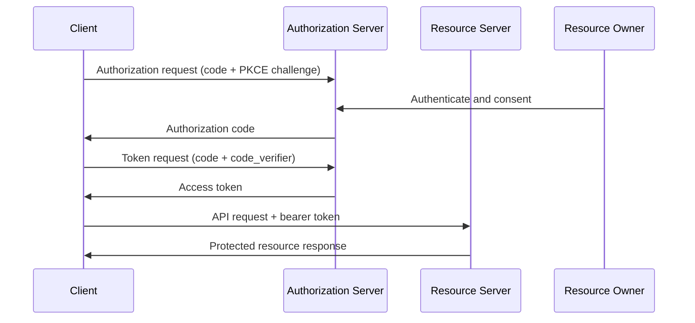

OAuth 2.0 is a delegated authorization framework. It allows a client to access protected resources on behalf of a resource owner without directly handling the owner’s primary credentials [1]. For IAM design, OAuth belongs to authorization, while OIDC adds identity semantics on top.

## What is it?

OAuth 2.0 defines roles, endpoints, grant mechanisms, and token handling for delegated API access [1], [2]. Its core value is scoped access using constrained tokens.

Roles defined by RFC 6749 [1]:

- `Resource owner`
- `Client`
- `Authorization server`
- `Resource server`

## Why do we need it? Where do we use it?

OAuth solves a critical problem: applications need API access without storing reusable user passwords. This is essential for SaaS integrations, mobile apps, partner ecosystems, and service automation [1], [3], [4].

Typical usage scenarios:

- Third-party integrations into business APIs
- Native/mobile app authorization with PKCE
- Machine-to-machine access with client credentials
- OIDC-based login and session establishment

## History Lesson

| When | What                                                                      |
| ---- | ------------------------------------------------------------------------- |
| 2012 | OAuth 2.0 framework is standardized in RFC 6749 [1].                      |
| 2012 | Bearer token usage is standardized in RFC 6750 [2].                       |
| 2015 | PKCE is standardized in RFC 7636 [3].                                     |
| 2017 | OAuth guidance for native apps is standardized in RFC 8252 [4].           |
| 2025 | OAuth 2.0 security best current practice is standardized in RFC 9700 [5]. |

## Interaction with other topics?

- **OIDC** extends OAuth with identity assertions (`../authentication/oidc.md`).
- **Token AuthN** covers token validation and lifecycle operations (`../authentication/token-authn.md`).
- **RBAC/ABAC** consume scopes and claims as policy inputs (`rbac-abac.md`).

## How does it work?

Recommended browser/mobile flow: Authorization Code + PKCE [3], [5].

1. Client starts authorization request.
2. Resource owner authenticates and grants consent.
3. Authorization server returns an authorization code.
4. Client exchanges code + verifier for access token.
5. Resource server validates token and scope before serving data.



Security essentials aligned with RFC 9700 [5]:

- Use PKCE for public and confidential clients where feasible.
- Register exact redirect URIs and reject mismatches.
- Avoid deprecated/unsafe patterns (for example implicit flow, ROPC).
- Use short-lived access tokens and refresh token rotation.

## Examples: Usage or Theory

### Example 1: Authorization code token exchange

Prerequisites: authorization code and PKCE verifier from prior authorization step.

```bash
$ set -euo pipefail
$ export TOKEN_ENDPOINT="https://idp.example.com/oauth2/token"
$ export CLIENT_ID="demo-client"
$ export REDIRECT_URI="https://app.example.com/callback"
$ export AUTH_CODE="<AUTHORIZATION_CODE>"
$ export CODE_VERIFIER="<PKCE_CODE_VERIFIER>"
$ curl -sS -X POST "${TOKEN_ENDPOINT}" \
  -H "Content-Type: application/x-www-form-urlencoded" \
  -d "grant_type=authorization_code" \
  -d "client_id=${CLIENT_ID}" \
  -d "code=${AUTH_CODE}" \
  -d "redirect_uri=${REDIRECT_URI}" \
  -d "code_verifier=${CODE_VERIFIER}"
```

Canonical success response shape:

```json
{
  "access_token": "<ACCESS_TOKEN>",
  "token_type": "Bearer",
  "expires_in": 3600,
  "scope": "projects:read"
}
```

Canonical error response shape:

```json
{
  "error": "invalid_grant",
  "error_description": "Authorization code is invalid or expired"
}
```

### Example 2: Scope model for API permissions

| Scope            | Meaning                                |
| ---------------- | -------------------------------------- |
| `projects:read`  | Read project data                      |
| `projects:write` | Create or modify project data          |
| `projects:admin` | Perform administrative project actions |

## References and further reading

[1] D. Hardt, "The OAuth 2.0 Authorization Framework," RFC 6749, Oct. 2012. [Online]. Available: https://www.rfc-editor.org/rfc/rfc6749

[2] M. Jones and D. Hardt, "The OAuth 2.0 Authorization Framework: Bearer Token Usage," RFC 6750, Oct. 2012. [Online]. Available: https://www.rfc-editor.org/rfc/rfc6750

[3] N. Sakimura et al., "Proof Key for Code Exchange by OAuth Public Clients," RFC 7636, Sep. 2015. [Online]. Available: https://www.rfc-editor.org/rfc/rfc7636

[4] W. Denniss and J. Bradley, "OAuth 2.0 for Native Apps," RFC 8252, Oct. 2017. [Online]. Available: https://www.rfc-editor.org/rfc/rfc8252

[5] D. Fett, B. Campbell, and J. Bradley, "Best Current Practice for OAuth 2.0 Security," RFC 9700, Jan. 2025. [Online]. Available: https://www.rfc-editor.org/rfc/rfc9700
