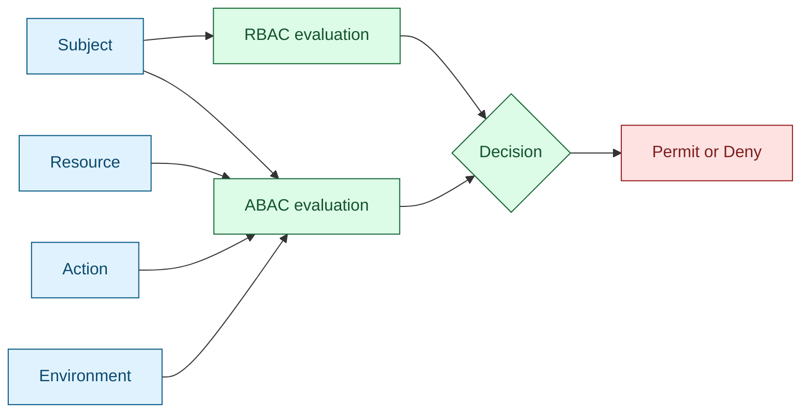

RBAC and ABAC are the two most common authorization modeling approaches. RBAC is easier to operate and widely supported in products, while ABAC is more expressive and context-aware but requires stronger data quality and policy governance [1], [2].

## What is it?

**RBAC (Role-Based Access Control)** assigns permissions to roles, then assigns roles to users or groups [1].

**ABAC (Attribute-Based Access Control)** evaluates policy rules using attributes from subject, resource, action, and environment [2].

In short:

- RBAC asks: "Which role does this identity have?"
- ABAC asks: "Which attributes and runtime context apply now?"

## Why do we need it? Where do we use it?

RBAC is ideal for stable responsibilities and clear operational boundaries. ABAC is ideal for context-rich decisions such as data classification, time windows, location, and risk level [1], [2].

Typical usage patterns:

- RBAC for SaaS administration and team-based platform access
- ABAC for fine-grained API/data controls and zero-trust patterns
- Hybrid model in large systems: RBAC baseline + ABAC exceptions

## History Lesson

| When | What                                                                                                    |
| ---- | ------------------------------------------------------------------------------------------------------- |
| 2000 | NIST publishes unified RBAC model guidance [1].                                                         |
| 2014 | NIST SP 800-162 provides ABAC design and governance guidance [2].                                       |
| 2015 | SCIM 2.0 enables interoperable user/group attribute provisioning used by ABAC-capable systems [3], [4]. |

## Interaction with other topics?

- **Identities and groups** are mandatory inputs for both models (`../identities-idp.md`).
- **Authentication** quality determines trust in subject claims (`../authentication/index.md`).
- **OAuth/OIDC tokens** often carry role or attribute claims consumed by policy engines.

## How does it work?

RBAC decision model (simplified):

```text
allow if user belongs_to group G
      and group G has role R
      and role R grants permission P
```

ABAC decision model (simplified):

```text
allow if subject.department == resource.department
      and action in resource.allowed_actions
      and environment.time in business_hours
```



## Examples: Usage or Theory

### Example 1: RBAC permission matrix

| Role                | Resource           | Actions                  |
| ------------------- | ------------------ | ------------------------ |
| `gitlab-maintainer` | `project/*`        | `read`, `write`, `merge` |
| `gitlab-reporter`   | `project/*`        | `read`                   |
| `k8s-read-only`     | `pods`, `services` | `get`, `list`, `watch`   |

### Example 2: ABAC policy snippet

```yaml
policy: invoice-approval
effect: allow
when:
  - subject.department == resource.department
  - subject.clearance >= resource.classification
  - action == "approve"
  - environment.time >= "08:00"
  - environment.time <= "18:00"
```

## References and further reading

[1] R. Sandhu, D. Ferraiolo, and R. Kuhn, "The NIST Model for Role-Based Access Control," NIST, Jul. 2000. [Online]. Available: https://www.nist.gov/publications/nist-model-role-based-access-control-towards-unified-standard

[2] V. C. Hu et al., "Guide to Attribute Based Access Control (ABAC)," NIST SP 800-162, Jan. 2014. [Online]. Available: https://csrc.nist.gov/pubs/sp/800/162/upd2/final

[3] P. Hunt et al., "System for Cross-domain Identity Management: Core Schema," RFC 7643, Sep. 2015. [Online]. Available: https://www.rfc-editor.org/rfc/rfc7643

[4] P. Hunt et al., "System for Cross-domain Identity Management: Protocol," RFC 7644, Sep. 2015. [Online]. Available: https://www.rfc-editor.org/rfc/rfc7644
