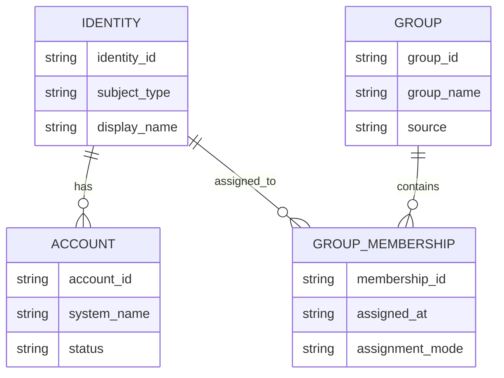

Before discussing authentication or authorization, we need a clean identity model. Most IAM failures are not protocol failures; they are modeling failures caused by unclear definitions of identity, account, group, and source of truth. This page defines those terms and shows how an IdP connects them in real systems [1], [2], [3].

## What is it?

A **digital identity** represents a subject (human or workload) in technical form. A **user account** is a system-specific principal tied to that identity. A **group** is a collection of accounts used for operational assignment and policy mapping [1], [3].

An **Identity Provider (IdP)** manages identities, authenticates subjects, and issues federation artifacts (for example, SAML assertions or OIDC tokens) to relying systems [1], [4], [5].

> **ℹ️ Info — Operational rule**
>
> Identity is not limited to people. Service accounts and workload identities must follow the same lifecycle and governance controls.

## Why do we need it? Where do we use it?

Centralized identity management avoids duplicate accounts, inconsistent group assignments, and manual privilege drift. IdPs provide central governance and consistent federation into downstream systems [1], [2].

Common usage areas:

- Workforce SSO across SaaS and internal platforms
- Provisioning and deprovisioning through SCIM [2], [3]
- Mapping organizational structure to technical access
- Joiner/Mover/Leaver lifecycle automation

## History Lesson

| When | What                                                                            |
| ---- | ------------------------------------------------------------------------------- |
| 2006 | LDAPv3 protocol and security are standardized in RFC 4511/4513 [6], [7].        |
| 2008 | OASIS publishes SAML 2.0 technical guidance for federation [4].                 |
| 2012 | OAuth 2.0 establishes delegated authorization patterns [8].                     |
| 2014 | OIDC 1.0 standardizes identity on top of OAuth 2.0 [5].                         |
| 2015 | SCIM 2.0 standardizes interoperable provisioning for users and groups [2], [3]. |
| 2025 | NIST SP 800-63C updates federation and assertion guidance [1].                  |

## Interaction with other topics?

- **Authentication**: the IdP is usually the trust anchor for AuthN (`authentication/index.md`).
- **Authorization**: group and attribute data from the IdP drives RBAC/ABAC policy evaluation (`authorization/rbac-abac.md`).
- **OAuth/OIDC**: identity and context claims are carried in tokens (`authentication/oidc.md`, `authorization/oauth.md`).

## How does it work?

A robust identity model separates conceptual and technical layers:

| Layer            | Purpose                                                 |
| ---------------- | ------------------------------------------------------- |
| Subject identity | Uniquely identifies a person or workload                |
| Account          | Login representation in a specific system               |
| Group            | Operational grouping for assignment and delegation      |
| IdP              | Authentication, federation, and lifecycle orchestration |
| Provisioning     | Automated account synchronization to target systems     |



A typical lifecycle implementation:

1. HR or upstream source sends identity events.
2. IdP creates or updates identity records.
3. Group assignments are rule-based or approved manually.
4. SCIM provisions account changes to connected systems [2], [3].
5. Offboarding deactivates accounts and revokes active access.

## Examples: Usage or Theory

### Example 1: Group naming model that remains maintainable

- **Groups** represent organization or function: `project-x-engineers`, `platform-team`, `oncall-team`.
- **Roles** represent system-specific permissions: `gitlab-maintainer`, `k8s-read-only`.
- Environment differences are applied in role mapping, not by renaming role definitions.

### Example 2: SCIM user provisioning request

Prerequisites: SCIM endpoint URL and an API token from your IdP.

```bash
$ set -euo pipefail
$ export SCIM_BASE_URL="https://idp.example.com/scim/v2"
$ export SCIM_TOKEN="<SCIM_BEARER_TOKEN>"
$ curl -sS -X POST "${SCIM_BASE_URL}/Users" \
  -H "Authorization: Bearer ${SCIM_TOKEN}" \
  -H "Content-Type: application/scim+json" \
  -d '{
    "schemas": ["urn:ietf:params:scim:schemas:core:2.0:User"],
    "userName": "max.mustermann@example.com",
    "name": {
      "givenName": "Max",
      "familyName": "Mustermann"
    },
    "active": true
  }'
```

Canonical success response shape:

```json
{
  "id": "2819c223-7f76-453a-919d-413861904646",
  "userName": "max.mustermann@example.com",
  "active": true,
  "meta": {
    "resourceType": "User"
  }
}
```

Canonical error response shape:

```json
{
  "schemas": ["urn:ietf:params:scim:api:messages:2.0:Error"],
  "status": "409",
  "detail": "userName already exists"
}
```

## References and further reading

[1] NIST, "SP 800-63C - Federation and Assertions." Accessed: Feb. 21, 2026. [Online]. Available: https://pages.nist.gov/800-63-4/sp800-63c.html

[2] P. Hunt et al., "System for Cross-domain Identity Management: Core Schema," RFC 7643, Sep. 2015. [Online]. Available: https://www.rfc-editor.org/rfc/rfc7643

[3] P. Hunt et al., "System for Cross-domain Identity Management: Protocol," RFC 7644, Sep. 2015. [Online]. Available: https://www.rfc-editor.org/rfc/rfc7644

[4] OASIS, "Security Assertion Markup Language (SAML) V2.0 Technical Overview," Mar. 2008. [Online]. Available: https://docs.oasis-open.org/security/saml/Post2.0/sstc-saml-tech-overview-2.0.pdf

[5] OpenID Foundation, "OpenID Connect Core 1.0 incorporating errata set 2," Dec. 2023. [Online]. Available: https://openid.net/specs/openid-connect-core-1_0.html

[6] K. Zeilenga, "Lightweight Directory Access Protocol (LDAP): The Protocol," RFC 4511, Jun. 2006. [Online]. Available: https://www.rfc-editor.org/rfc/rfc4511

[7] J. Hodges, R. Morgan, and M. Wahl, "LDAP: Authentication Methods and Security Mechanisms," RFC 4513, Jun. 2006. [Online]. Available: https://www.rfc-editor.org/rfc/rfc4513

[8] D. Hardt, "The OAuth 2.0 Authorization Framework," RFC 6749, Oct. 2012. [Online]. Available: https://www.rfc-editor.org/rfc/rfc6749
