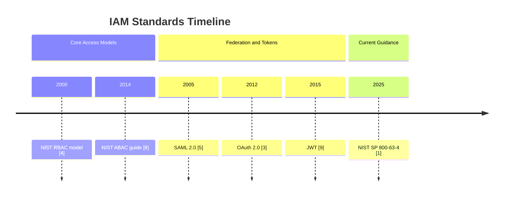

Identity and Access Management (IAM) defines how digital identities are created, verified, and authorized across systems. In practical terms, IAM answers three core questions: who is requesting access, how identity is proven, and what actions are allowed [1], [2], [3]. This document is the entry point for IAM concepts used across this knowledge base.

## What is it?

IAM is a combination of governance processes and technical controls used to manage access to digital resources. The NIST digital identity guidelines separate this area into identity proofing, authentication, federation, and lifecycle management of sessions and credentials [1], [2].

A complete IAM architecture typically includes:

- Identity stores and lifecycle workflows
- Authentication protocols and authenticators
- Authorization models and policy engines
- Logging, auditing, and compliance controls

## Why do we need it? Where do we use it?

Without IAM, organizations accumulate unmanaged accounts, excessive privileges, and weak auditability. IAM is therefore a foundational control for security, compliance, and operational stability in modern distributed systems [1], [3].

Common usage areas:

- Enterprise SSO for SaaS and internal applications
- Cloud platforms and Kubernetes environments
- API ecosystems (human and machine access)
- DevOps platforms (SCM, CI/CD, artifact registries)
- Regulated environments requiring traceability and recertification

## History Lesson

| When | What                                                                                   |
| ---- | -------------------------------------------------------------------------------------- |
| 2000 | The NIST RBAC model formalizes role-based access control [4].                          |
| 2005 | SAML 2.0 is standardized for federation and web SSO [5].                               |
| 2006 | LDAPv3 protocol and security methods are consolidated in RFC 4511/4513 [6], [7].       |
| 2012 | OAuth 2.0 is standardized for delegated authorization [3].                             |
| 2014 | NIST publishes SP 800-162 for ABAC guidance [8].                                       |
| 2015 | JWT is standardized in RFC 7519 [9].                                                   |
| 2025 | NIST SP 800-63-4 suite is published and modernizes digital identity guidance [1], [2]. |



## Interaction with other topics?

IAM interacts directly with existing topics in this repository:

- **Source code management**: repository and branch permissions are IAM policy outcomes (`../scm/git.md`).
- **Infrastructure as Code**: IAM roles and mappings should be managed as code (`../iac/terraform.md`).
- **CI/CD**: pipelines rely on non-human identities and short-lived credentials.

## How does it work?

At runtime, IAM behaves like a control pipeline:

1. A subject (human or workload) requests a resource.
2. Authentication verifies identity.
3. Authorization evaluates policy.
4. Enforcement permits or denies access.
5. Logging records the decision for audit.

```d2
direction: right

classes: {
  actor: {
    shape: person
    style: {
      bold: true
      fill: "#D9F2FF"
      stroke: "#0B6FA4"
    }
  }
  control: {
    style: {
      fill: "#E8FCE8"
      stroke: "#2F7A32"
      border-radius: 8
    }
  }
  decision: {
    style: {
      fill: "#FFE9E9"
      stroke: "#A12727"
      border-radius: 8
    }
  }
}

subject: Subject {class: actor}
idp: Identity Provider {class: control}
policy: Policy Engine {class: control}
resource: Resource Service {class: control}
audit: Audit Log {class: decision}

subject -> idp: Authenticate
idp -> policy: Send identity context
policy -> resource: Permit / Deny
resource -> audit: Decision + metadata
```

## Examples: Usage or Theory

### Example 1: IAM profile template for new systems

| Field                | Example                                   |
| -------------------- | ----------------------------------------- |
| System               | `gitlab-prod`                             |
| Identity source      | Entra ID as IdP                           |
| Authentication       | OIDC + MFA                                |
| Authorization model  | RBAC                                      |
| Critical roles       | `Maintainer`, `Auditor`, `Platform-Admin` |
| Environment strategy | DEV broader, PROD least privilege         |
| Audit control        | Quarterly access recertification          |

### Example 2: IAM implementation checklist

- Define authoritative identity source.
- Define authentication and step-up MFA policy.
- Define authorization model (RBAC, ABAC, or hybrid).
- Enforce least privilege and deny-by-default.
- Implement audit logging and recertification process.

## References and further reading

[1] NIST, "Digital Identity Guidelines (SP 800-63-4 Suite)." Accessed: Feb. 21, 2026. [Online]. Available: https://pages.nist.gov/800-63-4/

[2] NIST, "SP 800-63C - Federation and Assertions." Accessed: Feb. 21, 2026. [Online]. Available: https://pages.nist.gov/800-63-4/sp800-63c.html

[3] D. Hardt, "The OAuth 2.0 Authorization Framework," RFC 6749, Oct. 2012. [Online]. Available: https://www.rfc-editor.org/rfc/rfc6749

[4] R. Sandhu, D. Ferraiolo, and R. Kuhn, "The NIST Model for Role-Based Access Control," NIST, Jul. 2000. [Online]. Available: https://www.nist.gov/publications/nist-model-role-based-access-control-towards-unified-standard

[5] OASIS, "Security Assertion Markup Language (SAML) V2.0 Technical Overview," Mar. 2008. [Online]. Available: https://docs.oasis-open.org/security/saml/Post2.0/sstc-saml-tech-overview-2.0.pdf

[6] K. Zeilenga, "Lightweight Directory Access Protocol (LDAP): The Protocol," RFC 4511, Jun. 2006. [Online]. Available: https://www.rfc-editor.org/rfc/rfc4511

[7] J. Hodges, R. Morgan, and M. Wahl, "LDAP: Authentication Methods and Security Mechanisms," RFC 4513, Jun. 2006. [Online]. Available: https://www.rfc-editor.org/rfc/rfc4513

[8] V. C. Hu et al., "Guide to Attribute Based Access Control (ABAC)," NIST SP 800-162, Jan. 2014. [Online]. Available: https://csrc.nist.gov/pubs/sp/800/162/upd2/final

[9] M. Jones et al., "JSON Web Token (JWT)," RFC 7519, May 2015. [Online]. Available: https://www.rfc-editor.org/rfc/rfc7519
