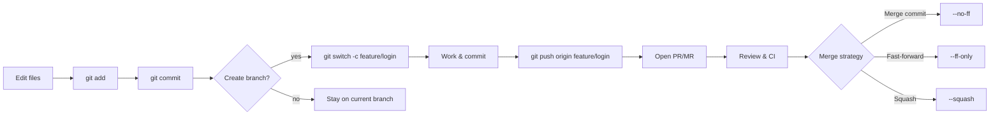
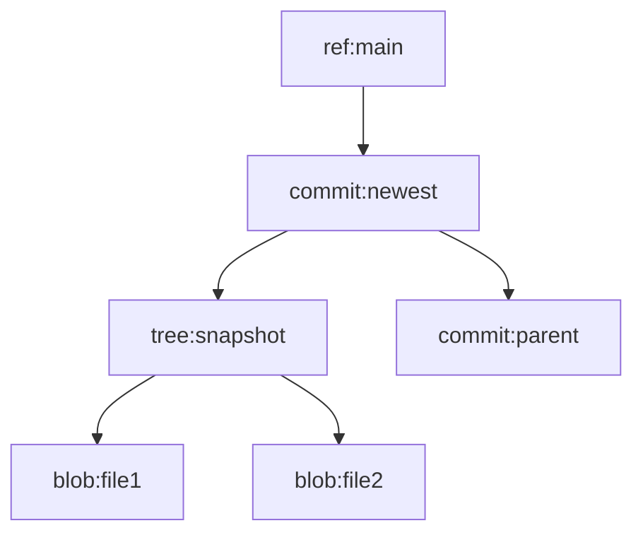

Git is a **distributed version control system (VCS)**.

In plain terms: it tracks changes to your files (usually code), lets several people work on the same project without stepping on each other's toes, and keeps the full history so you can rewind, branch off a wild idea, and merge it back if it turns out to be a good one.

The "distributed" part is the bit people skip over, so let me stress it: unlike centralized systems, every clone is a **full repository** with the complete history.
You can commit, branch, diff and dig through the log on a train with no WiFi.
Only pushing and pulling need the network.

> [!NOTE]
>
> Git ≠ GitHub/GitLab/Bitbucket.  
> Git is the tool.
> Those are hosting and collaboration platforms built _around_ Git repos.
> Pull Requests are not a Git feature - they're a platform feature, covered in [Pull Requests / Merge Requests](/kb/scm/mr-pr).

TL;DR for the impatient: you'll use `add`, `commit`, `push`, `pull`, `switch` and `log` for 95% of your life.
The rest of this page explains why they do what they do, which is the part that saves you when things go sideways at 2am.

## History Lesson

| Year          | Event                                                                                            |
| ------------- | ------------------------------------------------------------------------------------------------ |
| **2002–2005** | The Linux kernel team used BitKeeper (proprietary VCS).                                          |
| **Apr 2005**  | BitKeeper changed their license terms, hence **Linus Torvalds** creates Git for the kernel team. |
| **Jul 2005**  | **Junio C Hamano** becomes maintainer; rapid stabilization.                                      |
| **2008–2010** | GitHub, GitLab emerge.                                                                           |
| **2014–2021** | SHA-1 collision research → **SHA-256 transition plan**.                                          |
| **2019–2025** | Partial clones, sparse-checkout, protocol v2 improvements.                                       |

Fun detail: the thing the entire industry now runs on was written in a couple of weeks because somebody got annoyed about a license 🤷‍♂️

## How does it work

Git records **snapshots** of your project.
When you commit, Git stores the content of your files as objects in a local database, each identified by the SHA-1 hash of its contents.
Each commit points to those objects and to its parent commit(s), which forms a directed acyclic graph (DAG) - that graph _is_ your history.
More on DAGs [can be found here](/kb/misc/dag).

Branches are just pointers (refs) to specific commits.
Merging and rebasing move those pointers around to stitch histories together.
That's genuinely it.
Once "a branch is a 40-character file containing a commit hash" clicks, Git stops feeling like magic and starts feeling like a slightly grumpy database.

All of it lives locally, in the hidden `.git` directory.

**The .git folder explained:**

`.git` is the heart of the repository - all data, history and metadata Git needs.
`git init` creates it in your project root, and everything Git does happens in there.
Have a look inside some time, it's not scary:

```bash
git init demo && cd demo
ls -a .git
```

**Main components of the .git folder:**

`objects/`

Git's content database.
Every version of every file, directory (tree) and commit is stored here as a blob, tree or commit object.
Each object is named by the SHA-1 hash of its contents, which is what guarantees integrity - change one byte and you get a different object, no way around it.

- Blobs store file data.
- Trees store directory structures and filenames.
- Commits link trees with metadata (author, message, parents).

`refs/`

References (pointers) to specific commits:

- `refs/heads/` → Local branches
- `refs/remotes/` → Remote-tracking branches
- `refs/tags/` → Tags

Each ref is just a text file containing a commit hash.
`cat .git/refs/heads/main` and see for yourself 😄

`HEAD`

A special file pointing at the currently checked-out branch (or straight at a commit, the famous "detached HEAD" state).
Example content:

```
ref: refs/heads/main
```

`index`

Also known as the staging area.
A binary file tracking which changes are staged, meaning ready for the next commit.
`git add` updates this file - that's the whole mystery.

`config`

Plain text, repository-specific configuration: user name, email, remotes, merge behavior, etc. It complements the global settings in `~/.gitconfig`.

`logs/`

Stores reflogs - a record of every update to branches and HEAD.
This is your undo button after a reset or rebase goes sideways.
Remember `git reflog` exists, future you will be grateful.

- Other files and folders
- `info/` - additional exclude patterns (`info/exclude`) and internal data.
- `hooks/` - scripts that run automatically on Git events (e.g. pre-commit).
- `description` - used by Git web interfaces (e.g. gitweb).

### The mental model: three areas

If you remember one thing from this page, make it this table.
Most Git confusion is really just "which of the three am I looking at right now?".

| Area                     | What it is                            | Typical commands         |
| ------------------------ | ------------------------------------- | ------------------------ |
| **Working directory**    | Your files on disk.                   | `git status`, `git diff` |
| **Staging area (index)** | What will go into the next commit.    | `git add`, `git reset`   |
| **Repository (.git)**    | History: commits, trees, blobs, refs. | `git commit`, `git log`  |

**Typical flow**

```bash
git status # what's going on right now?
git add src/app.py README.md # move changes into the staging area
git commit -m "feat(app): add CLI argument parsing" # write them into history (see Naming Conventions)
git push origin main # share them with the remote
```

`git status` is free and tells you exactly where you are.
Run it constantly, nobody's judging.

That commit message format isn't decoration either - `feat(app):` is [Conventional Commits](/kb/scm/naming-conventions), and tooling reads it to work out your next version number.

### Commit → Branch → Merge



### Git object model (DAG)



- **Blob:** raw file content
- **Tree:** directory snapshot
- **Commit:** metadata + parents
- **Ref:** branch/tag name → commit ID

Four object types.
That's the entire data model - everything else is commands shuffling these around.

### Branching strategies

| Strategy                | Use when                | Pros                | Cons                 |
| ----------------------- | ----------------------- | ------------------- | -------------------- |
| **Trunk-Based**         | Continuous delivery     | Simple flow         | Needs strong testing |
| **Git Flow**            | Release-driven products | Organized releases  | Heavy process        |
| **Feature Branch + PR** | Most teams              | Clear review points | Many PRs can pile up |

Feature branch + PR is the safe default for a small team - mostly because the PR is where you notice that two people implemented the same function twice 😅

Full breakdown of each model, with diagrams, at [Branching Strategies](/kb/scm/branching).

> [!WARNING]
>
> Avoid long-lived, drifting branches.
> Rebase or merge frequently.
> The branch you haven't touched in three weeks will not merge cleanly.
> It never does.

### Merge vs Rebase

```bash
# Merge feature into main
git switch main
git pull --ff-only
git merge --no-ff feature/login

# Rebase feature on latest main
git switch feature/login
git fetch origin
git rebase origin/main
```

Merge keeps the real history including the messy parts.
Rebase rewrites your commits on top of the latest `main` so the log reads like a straight line.

Personal opinion: rebase your own feature branch as much as you like, it's yours.
Don't rebase anything others have already pulled - rewriting shared history is how you become _that_ person on the team.

## Where to go next

- [Branching Strategies](/kb/scm/branching) - Trunk-Based, GitHub Flow, Git Flow, Release Flow
- [Pull Requests / Merge Requests](/kb/scm/mr-pr) - the review layer the platforms add on top
- [Naming Conventions](/kb/scm/naming-conventions) - Conventional Commits, SemVer, tags, branch names
- [Source Code Management](/kb/scm) - the wider picture, and what came before Git

## References and further reading

- Official docs: <https://git-scm.com/doc>
- _Pro Git_ (free book, genuinely good): <https://git-scm.com/book/en/v2>
- GitHub cheat sheet: <https://training.github.com/downloads/github-git-cheat-sheet.pdf>
- Trunk-Based Development: <https://trunkbaseddevelopment.com/>
- Conventional Commits: <https://www.conventionalcommits.org/en/v1.0.0/>
- Deep dive, builds Git from scratch: <https://maryrosecook.com/blog/post/git-from-the-inside-out>
