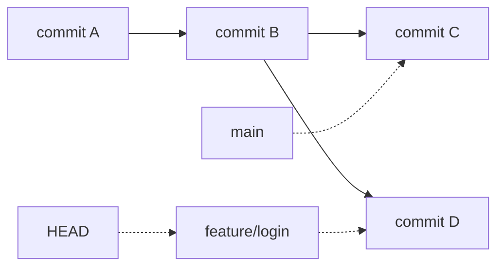
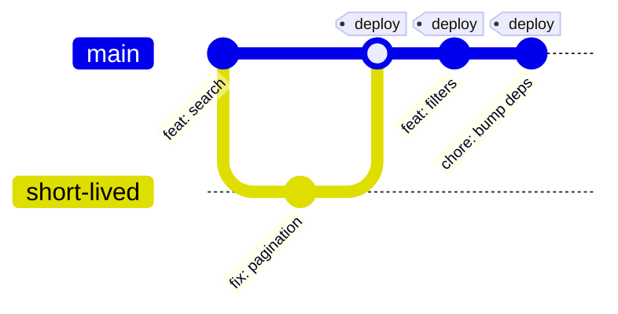
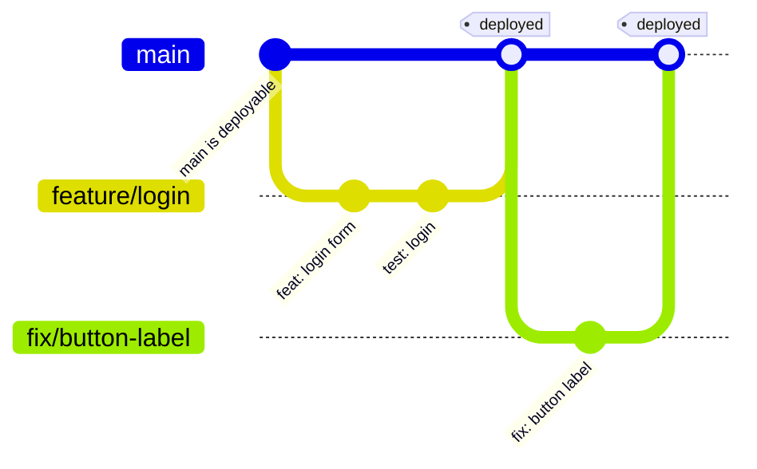
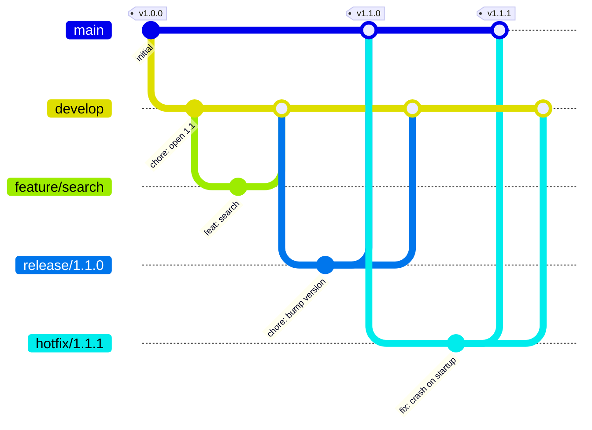
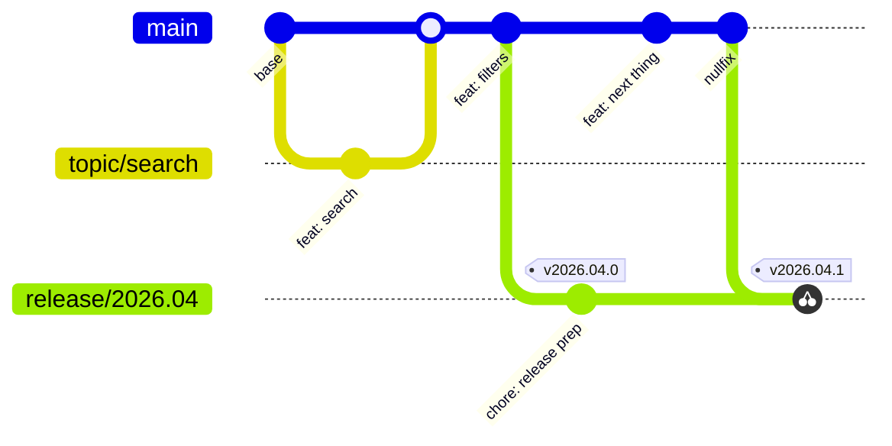
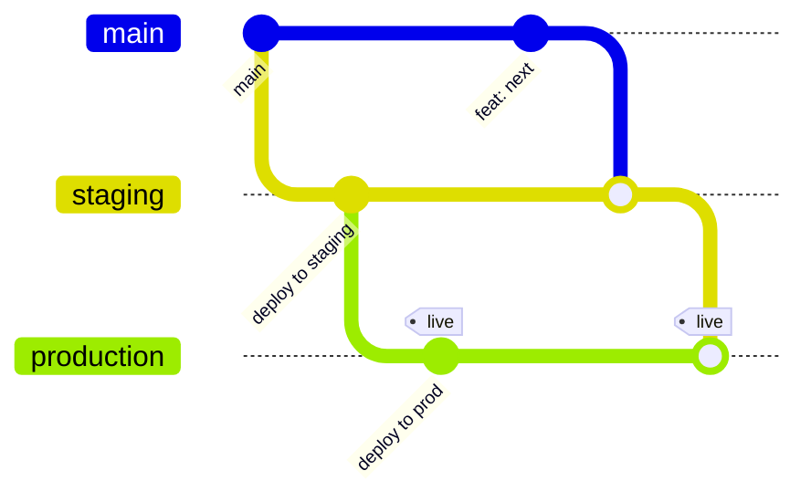

A **branch** is a movable pointer to a commit.
That's it.
That's the whole feature.

Everyone expects something heavier - a copy of the project, a folder somewhere, _some_ kind of storage cost.
Nope.
`refs/heads/main` is a text file containing 40 characters.
Creating a branch writes a new 40-character file.
Deleting one removes it.
This is why branching in Git is instant while the same operation in older systems (looking at you, SVN) was something you planned ahead for.

> [!NOTE]
>
> Branching is cheap, _merging_ is where the work happens.
> The strategies on this page are all basically answers to one question: "how do we keep merges boring?"

See [Git](/kb/scm/git) for the object model underneath all of this.

## The mechanics first

```bash
git switch -c feature/login     # create branch + switch to it
git switch main                 # switch back
git branch                      # list local branches
git branch -d feature/login     # delete (safe, refuses if unmerged)
git push origin feature/login   # publish it to the remote
```

`git switch` and `git restore` replaced the overloaded `git checkout` back in Git 2.23 (2019).
`checkout` still works and half the internet still uses it, but `switch` says what it does - worth retraining your fingers.

**HEAD** points at the branch you're currently on.
When you commit, Git moves that branch pointer forward one commit.
Nothing else in the repository changes.



Two branches, four commits, zero copies of your source tree.

## History Lesson

Branching models didn't come from Git itself - Git ships the mechanism and stays deliberately opinion-free.
The opinions came from the platforms and the people using them.

| Year     | What happened                                                                                                                            |
| -------- | ---------------------------------------------------------------------------------------------------------------------------------------- |
| **2005** | Git is released. Branches are cheap for the first time, and nobody is quite sure what to do with that yet.                               |
| **2008** | **GitHub** launches, and makes the _Pull Request_ the unit of collaboration. Branch-per-change becomes the norm.                         |
| **2010** | Vincent Driessen publishes **"A successful Git branching model"** - the post the world renamed **Git Flow**.                             |
| **2011** | **GitLab** launches (self-hostable, later the "everything DevOps" platform). Merge Requests are the same idea under a different name.    |
| **2011** | Scott Chacon describes **GitHub Flow** - essentially "Git Flow, but delete most of it".                                                  |
| **2014** | **GitLab Flow** adds environment branches for teams that can't ship to production on every merge.                                        |
| **2018** | Microsoft publishes **Release Flow**, the model behind Azure DevOps - trunk plus release branches, developed at a genuinely large scale. |
| **2020** | Driessen adds a note to his own Git Flow post saying it's probably not what you want for continuous delivery. Respect for that one 🙇    |
| **2020** | Default branch naming moves from `master` to `main` across GitHub, GitLab and Git itself (`init.defaultBranch`).                         |

Worth knowing: **GitHub** and **GitLab** are Git _hosting platforms_, not Git.
They add the social layer - pull/merge requests, reviews, CI, permissions, protected branches.
Every flow below is really a combination of Git branches plus platform rules enforcing them.
More at [Pull Requests / Merge Requests](/kb/scm/mr-pr).

---

## Trunk-Based Development

One long-lived branch (`main`, the "trunk").
Branches exist, but they live for hours, not weeks.
Everything merges back fast, behind feature flags if it isn't finished.



**Good:** simplest possible history, merge conflicts barely happen, every commit is a release candidate.
**Bad:** demands real test coverage and a working [CI](/kb/cicd/ci) pipeline.
Without those it's just pushing to main and hoping.

Use it when you genuinely do continuous delivery.
It's the model with the best evidence behind it (the DORA research keeps pointing this direction) - and the one most teams aren't honest enough about their test suite to pull off.

---

## GitHub Flow

The lightweight one.
`main` is always deployable.
Any change gets a branch, a Pull Request, review and CI, then merges back and ships.



**Good:** almost no ceremony, obvious review point, easy to teach.
**Bad:** no concept of a release.
If you need to support version 2.3 while 2.5 is in development, this model has no answer for you.

This is the sane default for web apps, services and most internal tooling.
Start here, add process only when something actually hurts.

---

## Git Flow

The heavy one, and the one everybody's seen a diagram of.
Two permanent branches (`main` = released, `develop` = integration) plus three supporting types: `feature/*`, `release/*`, `hotfix/*`.



**Good:** genuinely solves parallel release maintenance, versioned products, scheduled releases.
**Bad:** a lot of branches, a lot of merging, and `develop` drifting from `main` is a recurring tax.

> [!WARNING]
>
> Git Flow gets cargo-culted onto web apps that deploy twelve times a day, where it adds pure overhead.
> If you ship continuously and only ever support one version, you do not need `develop`.
> The author himself says so.

Use it for installable/versioned software: desktop apps, libraries with long support windows, firmware, anything where "just deploy the fix" isn't a thing.

---

## Release Flow

Microsoft's model, and the pragmatic middle ground.
Trunk-based day to day, but each release cuts a **release branch** off `main`.
Fixes always land on `main` first, then get **cherry-picked** into the release branch - never the other way around.



**Good:** one integration branch, releases are still supportable, no `develop` drift.
**Bad:** cherry-picking is manual effort and needs discipline about direction.

The "fix forward on main, then cherry-pick back" rule is the whole trick.
It guarantees a fix can never exist on a release branch but be missing from the next release - which is the classic Git Flow footgun.

---

## GitLab Flow

GitHub Flow plus **environment branches** for teams that can't deploy straight to production on merge.
`main` flows into `staging`, then `production` - downstream only, never back up.



Deployment becomes "merge into the next branch down", which gives you an audit trail of what's running where.
Useful with regulated release gates.
If your [CD](/kb/cicd/cd) pipeline already tracks environments properly, this is largely redundant.

---

## Picking one

| Strategy         | Use when                                   | Pros                              | Cons                           |
| ---------------- | ------------------------------------------ | --------------------------------- | ------------------------------ |
| **Trunk-Based**  | True continuous delivery                   | Simplest history, minimal merging | Needs strong tests + CI        |
| **GitHub Flow**  | Web apps, services, one live version       | Low ceremony, clear review point  | No release concept             |
| **Release Flow** | Shipping on a cadence, supporting releases | Trunk-ish, releases stay fixable  | Cherry-picking is manual       |
| **Git Flow**     | Versioned/installable products             | Handles parallel versions         | Heavy process, `develop` drift |
| **GitLab Flow**  | Explicit environment gates                 | Visible audit trail per env       | Often duplicates what CD does  |

Honest shortcut: **GitHub Flow** unless you have a concrete reason not to, **Release Flow** the moment you need to support a shipped version.
Git Flow only if you really do maintain multiple versions in parallel.

Whichever you pick, the thing that actually determines whether it works:

- **Short-lived branches.**
  A branch open for three weeks will not merge cleanly.
  It never does.
- **Protected `main`.**
  No direct pushes, require review and green CI.
  See [Pull Requests / Merge Requests](/kb/scm/mr-pr).
- **Consistent names.**
  `feature/`, `fix/`, `release/` - see [Naming Conventions](/kb/scm/naming-conventions).
- **Automated tests.**
  Every strategy above degrades into "merge and pray" without them.

> [!WARNING]
>
> The strategy matters far less than the discipline.
> A team doing boring GitHub Flow properly beats a team doing Git Flow badly, every single time.

## Keeping a branch current

Your branch gets stale the moment someone else merges.
Two ways to catch up:

```bash
# Merge main into your branch - keeps true history, adds a merge commit
git switch feature/login
git merge main

# Rebase onto main - replays your commits on top, linear history
git switch feature/login
git fetch origin
git rebase origin/main
```

Rebase your own unshared branch freely.
Don't rebase anything others have already pulled - rewriting shared history is how you become _that_ person on the team.

## References and further reading

- Driessen's original Git Flow post (read the 2020 note at the top): <https://nvie.com/posts/a-successful-git-branching-model/>
- GitHub Flow: <https://docs.github.com/en/get-started/using-github/github-flow>
- Microsoft Release Flow: <https://learn.microsoft.com/en-us/devops/develop/how-microsoft-develops-devops>
- Trunk-Based Development: <https://trunkbaseddevelopment.com/>
- GitLab Flow: <https://about.gitlab.com/topics/version-control/what-is-gitlab-flow/>
- _Pro Git_, branching chapter: <https://git-scm.com/book/en/v2/Git-Branching-Branches-in-a-Nutshell>
