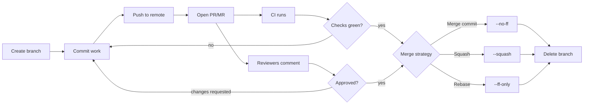
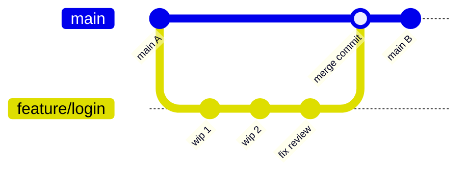

First, the thing that trips everyone up: **Pull Requests are not a Git feature.**

Git has no idea they exist.
`git pull-request` is not a command.
A PR is something GitHub, GitLab and friends built _on top of_ Git, and it's arguably the single most important thing those platforms added.

| Platform                 | What they call it      |
| ------------------------ | ---------------------- |
| GitHub, Bitbucket, Gitea | **Pull Request** (PR)  |
| GitLab                   | **Merge Request** (MR) |
| Gerrit                   | **Change**             |

Same concept throughout.
GitLab's name is honestly the more accurate one - you're requesting a merge, not a pull - but GitHub got there first and "PR" won the language 🤷‍♂️

## What one actually is

A PR is a **request to merge one branch into another**, wrapped in a review and discussion UI.

That's genuinely all.
Underneath, when it merges, the platform runs the same `git merge` you could run yourself.
What you're paying for is everything _around_ the merge: a diff anyone can read, a place to argue about it, a gate that CI can block, and a permanent record of why the change looks the way it does.

That last part is underrated.
Six months later, `git blame` gets you to a commit, the commit gets you to a PR, and the PR has the conversation explaining why that weird-looking workaround exists.



## The lifecycle

```bash
# 1. branch off the target
git switch main
git pull --ff-only
git switch -c feature/oidc-login

# 2. do the work
git add src/auth/oidc.py
git commit -m "feat(auth): add OIDC login flow"

# 3. publish
git push -u origin feature/oidc-login
```

Push, and the platform prints a "create a pull request" URL right in your terminal.
From there it's all web UI (or `gh pr create` / `glab mr create` if you'd rather not leave the shell).

Then: CI runs, reviewers look, you push fixes to the same branch - the PR updates automatically, because it tracks the _branch_, not a snapshot.
When it's green and approved, you merge.

## What they can do

This is the part worth knowing, because most teams use maybe a third of it.

| Capability                 | What it does                                                                                          |
| -------------------------- | ----------------------------------------------------------------------------------------------------- |
| **Reviews & approvals**    | Approve / request changes / comment. Require N approvals before merge is possible.                    |
| **Required status checks** | Merge button stays disabled until [CI](/kb/cicd/ci) passes. The single highest-value setting.         |
| **Protected branches**     | No direct pushes to `main` - everything goes through a PR. Pairs with the above.                      |
| **CODEOWNERS**             | A file mapping paths to people. Touch `/infra/**` and the platform team gets auto-requested.          |
| **Draft / WIP**            | Open it early for visibility, blocks merging until marked ready.                                      |
| **Suggested changes**      | Reviewer writes the exact fix in the diff; author applies it with one click. Underused, great.        |
| **Auto-merge**             | Queue the merge now, platform does it the second checks go green.                                     |
| **Merge queue**            | Serialises merges and re-tests each against the real tip. For busy repos where `main` keeps breaking. |
| **Templates**              | `.github/PULL_REQUEST_TEMPLATE.md` pre-fills the description so people stop writing "fixes stuff".    |
| **Linked issues**          | "Closes #42" in the description auto-closes the issue on merge.                                       |
| **Linked pipelines**       | Build/test/scan results inline in the diff, including security scans and coverage deltas.             |

> [!NOTE]
>
> Protected branch + required CI check is roughly 80% of the value.
> Set those two first.
> Everything else is refinement.

## Merge strategies

Three buttons, three different histories.
Your team should pick one and stop re-deciding per PR.



| Strategy           | What lands on `main`                  | Good                                     | Bad                                                  |
| ------------------ | ------------------------------------- | ---------------------------------------- | ---------------------------------------------------- |
| **Merge commit**   | Every branch commit + a merge commit  | Full honest history, nothing rewritten   | Noisy log, "wip" commits forever                     |
| **Squash**         | One single commit                     | Clean, readable `main`, 1 PR = 1 commit  | Loses intermediate steps, awkward reverts of big PRs |
| **Rebase & merge** | Each commit replayed, no merge commit | Linear history, keeps individual commits | Rewrites hashes, needs tidy commits                  |

Honest take: **squash** is the right default for most teams.
It makes `main` readable, pairs perfectly with [Conventional Commits](/kb/scm/naming-conventions) (the PR title becomes the commit message), and nobody has to pretend their "wip", "wip 2", "actually fix it" commits were craftsmanship.

Use merge commits when the individual commits were genuinely curated and matter.
Use rebase when you want linear history _and_ trust everyone to write clean commits - which is a bigger assumption than it sounds.

## Using them well

**As the author:**

- **Keep them small.**
  The strongest predictor of review quality.
  A 50-line PR gets a real review; a 2000-line PR gets "LGTM" 💀 Split by concern, not by file count.
- **Write the description for someone with no context.**
  What changed, why, how you tested it, anything you're unsure about.
  Link the ticket.
- **Open a draft early** if the approach is risky.
  Cheaper to hear "don't do it that way" on day one than day five.
- **Self-review the diff first.**
  You'll catch the leftover `console.log` before a human spends their time on it.
- **Don't force-push mid-review** - it discards reviewers' place in the diff.
  Push fixes as new commits, squash at merge time.
- **Keep the branch current** so you're not merging against three-week-old code.
  See [Branching Strategies](/kb/scm/branching).

**As the reviewer:**

- **Review the change, not the person.**
  "This leaks a file handle" beats "you forgot to close the file".
- **Separate blocking from optional.**
  Prefix nits with `nit:` so the author knows what actually blocks the merge.
- **Use suggested changes** for anything trivial - saves a whole round trip.
- **Be quick.**
  A PR sitting for three days is a branch drifting for three days.
  Review latency is a real cost.
- **Approve when it's better than what's on `main`.**
  Not when it's perfect.
  Perfect never merges.

> [!WARNING]
>
> A PR that's been open for two weeks is not "under review", it's abandoned.
> Either merge it, close it, or split it into something reviewable.
> Stale PRs are where good work goes to die.

## Fork-based workflow

You can't push a branch to a repo you don't have write access on - which is every open source project you don't maintain.
So you **fork** it (your own server-side copy), push there, and open the PR across repos.

```bash
# fork via the web UI or: gh repo fork owner/project --clone
git clone https://github.com/<you>/project.git
cd project
git remote add upstream https://github.com/owner/project.git

git switch -c fix/typo-in-readme
git commit -am "docs: fix typo in installation steps"
git push origin fix/typo-in-readme
# → open the PR against owner/project
```

The `upstream` remote is how you stay current:

```bash
git fetch upstream
git rebase upstream/main
```

Same review flow, just across two repositories.
Maintainers get contributions without handing out write access, which is the only reason open source collaboration scales at all.

## Common pitfalls

- **Merging your own PR with no review** - defeats the entire mechanism.
  If you're solo, protected branches still catch accidental pushes to `main`.
- **Targeting the wrong branch.**
  Check the base.
  On Git Flow repos it's usually `develop`, not `main`.
- **Treating CI as advisory.**
  If a red pipeline can be merged anyway, it will be, and then it's always red.
- **Giant "refactor everything" PRs.**
  Nobody reviews those.
  They get rubber-stamped, which is worse than no review.
- **Letting the branch rot after merge.**
  Delete it.
  Enable auto-delete on merge and stop thinking about it.

## References and further reading

- GitHub - About Pull Requests: <https://docs.github.com/en/pull-requests>
- GitLab - Merge Requests: <https://docs.gitlab.com/ee/user/project/merge_requests/>
- CODEOWNERS syntax: <https://docs.github.com/en/repositories/managing-your-repositorys-settings-and-features/customizing-your-repository/about-code-owners>
- Google's Code Review Developer Guide (the good one): <https://google.github.io/eng-practices/review/>
- `gh` CLI: <https://cli.github.com/> · `glab` CLI: <https://gitlab.com/gitlab-org/cli>
