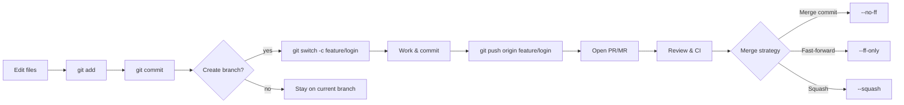
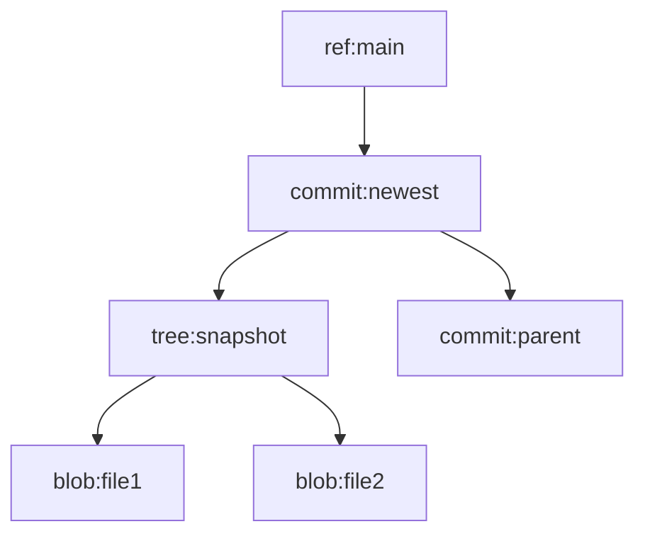

Git is a **distributed version control system (VCS)**.
In plain terms: it tracks changes to files (usually code), lets multiple people work on the same project without stepping on each other’s toes, and keeps a complete history so you can rewind, branch off ideas, and merge them back.
Unlike centralized systems, every clone is a **full repository** with complete history and tooling - so you can commit, branch, diff, and inspect history even when you’re offline.

> **📝 Note**
>
> Git ≠ GitHub/GitLab/Bitbucket.  
> Git is the tool; those are hosting/collaboration platforms built around Git repos.

## Why do we need it? Where do we use it?

**Why:**

- **History & accountability:** who changed what, when, and why.
- **Parallel work:** branch-based workflows allow features, fixes, and experiments to evolve independently.
- **Safe refactoring:** commit early & often; revert when needed.
- **Code review & CI/CD:** integrates tightly with pull/merge requests, automated tests, and deployments.
- **Reproducibility:** tag releases and rebuild exactly what shipped.

**Where:**

- **Software projects** of any size (from scripts to the Linux kernel).
- **Data & research** (version notebooks, datasets, docs, papers, etc.).
- **Configuration & infrastructure** (IaC, documentation sites,..).

## History Lesson

| Year          | Event                                                                                            |
| ------------- | ------------------------------------------------------------------------------------------------ |
| **2002–2005** | The Linux kernel team used BitKeeper (proprietary VCS).                                          |
| **Apr 2005**  | BitKeeper changed their license terms, hence **Linus Torvalds** creates Git for the kernel team. |
| **Jul 2005**  | **Junio C Hamano** becomes maintainer; rapid stabilization.                                      |
| **2008–2010** | GitHub, GitLab emerge.                                                                           |
| **2014–2021** | SHA-1 collision research → **SHA-256 transition plan**.                                          |
| **2019–2025** | Partial clones, sparse-checkout, protocol v2 improvements.                                       |

## Interaction with other topics?

TBD

## How does it work?

Git works by recording snapshots of your project’s files.
When you commit, Git stores the content of files as objects in a local database, identified by their SHA-1 hash.
Each commit points to these objects and to its parent commit(s), forming a directed acyclic graph (DAG) that represents the project’s history.
More on DAGs [can be found here](/kb/misc/dag).

Branches are just pointers (refs) to specific commits, and merging or rebasing manipulates these pointers to integrate histories.
All data is stored locally in the hidden .git directory.

**the .git Folder Explained:**

The .git folder is the heart of a Git repository.
It stores all data, history, and metadata that Git needs to manage your project’s versions.
When you run `git init`, this hidden folder is created in your project root — and everything Git does happens inside it.

**main Components of the .git Folder:**

- `objects/`:

This is Git’s database of content.
Every version of every file, directory (tree), and commit is stored here as a blob, tree, or commit object.
Each object is named by a SHA-1 hash of its contents, which guarantees integrity.

- Blobs store file data.
- Trees store directory structures and filenames.
- Commits link trees with metadata (author, message, parents).

- `refs/`:

Contains references (pointers) to specific commits:

- refs/heads/ → Local branches
- refs/remotes/ → Remote-tracking branches
- refs/tags/ → Tags

Each ref is just a text file containing a commit hash.

- `HEAD`:

A special file that points to the currently checked-out branch (or directly to a commit in "detached HEAD" state).
Example content:

```
ref: refs/heads/main
```

- `index`:

Also known as the staging area.
It’s a binary file that keeps track of which changes are staged (ready for commit).
When you run `git add`, Git updates this file.

- `config`:

A plain text file holding repository-specific configuration like user name, email, remotes, merge behavior, etc.
It complements global settings stored in `~/.gitconfig`.

- `logs/`:

Stores reflogs — records of updates to branches and HEAD.
This lets you recover commits even after operations like reset or rebase.

- Other files and folders
- `info/` – Additional exclude patterns (info/exclude) and internal data.
- `hooks/` – Scripts that run automatically on Git events (e.g., pre-commit).
- `description` – Used by Git web interfaces (e.g., gitweb).

### The mental model: three areas

| Area                     | What it is                            | Typical commands         |
| ------------------------ | ------------------------------------- | ------------------------ |
| **Working directory**    | Your files on disk.                   | `git status`, `git diff` |
| **Staging area (index)** | What will go into the next commit.    | `git add`, `git reset`   |
| **Repository (.git)**    | History: commits, trees, blobs, refs. | `git commit`, `git log`  |

**Typical flow**

```bash
git status # get current repo state
git add src/app.py README.md # add files to staging area
git commit -m "feat(app): add CLI argument parsing" # commit files to repository
git push origin main # push changes to remote repository
```

### Commit → Branch → Merge



### Git object model (DAG)



- **Blob:** raw file content
- **Tree:** directory snapshot
- **Commit:** metadata + parents
- **Ref:** branch/tag name → commit ID

### Branching strategies

| Strategy                | Use when                | Pros                | Cons                 |
| ----------------------- | ----------------------- | ------------------- | -------------------- |
| **Trunk-Based**         | Continuous delivery     | Simple flow         | Needs strong testing |
| **Git Flow**            | Release-driven products | Organized releases  | Heavy process        |
| **Feature Branch + PR** | Most teams              | Clear review points | Many PRs can pile up |

See further details at [Branching Strategies](/kb/scm/branching)

> **⚠️ Warning**
>
> Avoid long-lived, drifting branches. Rebase or merge frequently.

### Merge vs Rebase

```bash
# Merge feature into main
git switch main
git pull --ff-only
git merge --no-ff feature/login

# Rebase feature on latest main
git switch feature/login
git fetch origin
git rebase origin/main
```

## References and further reading

- Official docs: <https://git-scm.com/doc>
- _Pro Git_ (free book): <https://git-scm.com/book/en/v2>
- GitHub cheat sheet: <https://training.github.com/downloads/github-git-cheat-sheet.pdf>
- Trunk-Based Development: <https://trunkbaseddevelopment.com/>
- Conventional Commits: <https://www.conventionalcommits.org/en/v1.0.0/>
- Deep dive: <https://maryrosecook.com/blog/post/git-from-the-inside-out>
