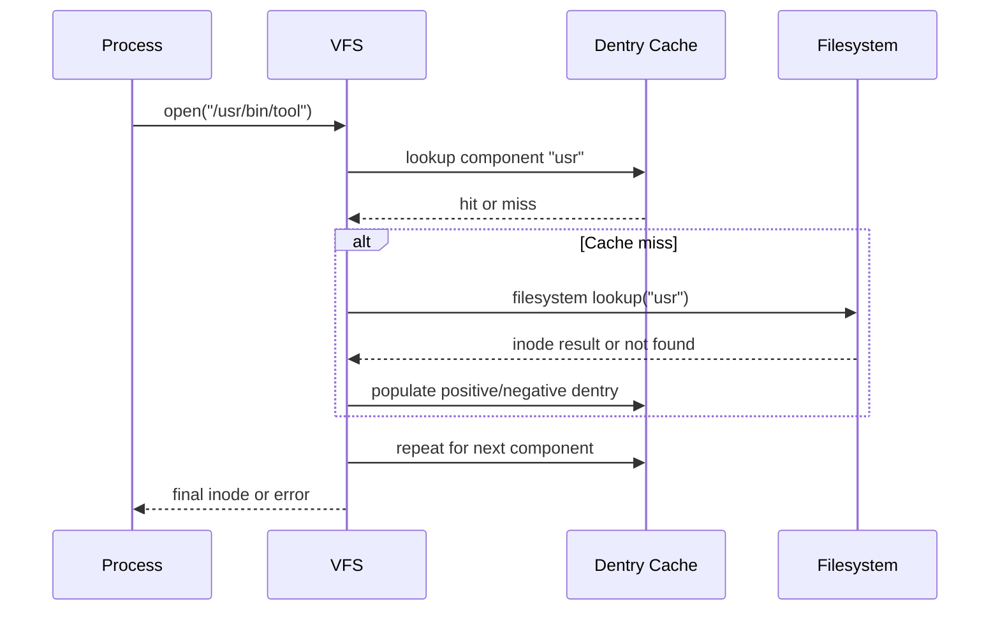
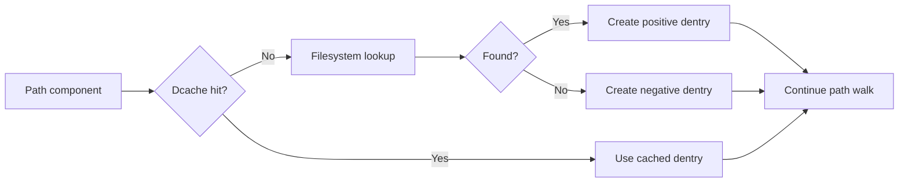

A dentry is the VFS object that represents a path component mapping within a directory context. The dentry cache (dcache) accelerates pathname resolution by reusing prior lookup results and avoiding repeated filesystem calls [1], [2].

## What is it?

Dentries are in-memory objects. They map names to inode references for path traversal, but they are not persistent on-disk records. Persistent directory content remains filesystem-owned [1], [2].

Two dentry states are operationally important:

- **Positive dentry**: name resolves to an existing inode.
- **Negative dentry**: name lookup failed and result is cached to avoid repeated misses.

## Why do we need it? Where do we use it?

Dentry behavior directly affects lookup latency and metadata-heavy workload performance. You see its impact in application startup time, package manager performance, and recursive directory traversal workloads [1], [2].

Dentry understanding is useful for:

- diagnosing repeated lookup misses
- reasoning about path-walk performance
- understanding why namespace operations can be fast even on large trees

## History Lesson

| When  | What                                                                                  |
| ----- | ------------------------------------------------------------------------------------- |
| 1991  | Linux adopts a VFS model requiring efficient name-to-object traversal [2].            |
| 2000s | Dcache behavior and path-lookup internals are formalized in kernel documentation [1]. |
| 2020  | `openat2(2)` introduces stricter lookup constraints on modern Linux kernels [3].      |

## Interaction with other topics?

- [Linux VFS](/kb/storage/vfs): VFS owns path traversal logic and cache interactions.
- [Inodes](/kb/storage/inodes): positive dentries reference inodes.
- [Mounting](/kb/storage/mounting): mountpoints alter traversal target while dentries continue path-walk semantics.

## How does it work?

Each path component lookup checks dcache first. On miss, VFS asks the filesystem to resolve and then populates cache state.





## Examples: Usage or Theory

### Example 1: Repeated lookup micro-test (indirect dcache observation)

Prerequisites: Linux host with `/usr/bin/env` present.

```bash
$ set -euo pipefail
$ TARGET="/usr/bin/env"
$ /usr/bin/time -f 'elapsed=%E' bash -lc 'for i in $(seq 1 50000); do stat "$0" >/dev/null; done' "${TARGET}"
```

This does not expose dcache directly, but it demonstrates repeated metadata lookup behavior in a stable path.

### Example 2: Negative lookup behavior (conceptual)

```bash
$ set -euo pipefail
$ MISSING="/tmp/this-file-should-not-exist-$(date +%s)-$$"
$ stat "${MISSING}" || true
$ stat "${MISSING}" || true
```

Both calls fail with `ENOENT`; the second call may be faster due to cached miss state [1], [2].

## References and further reading

[1] Linux Kernel Documentation, "Dentry Cache (dcache)." Accessed: Feb. 21, 2026. [Online]. Available: https://www.kernel.org/doc/html/latest/filesystems/dcache.html

[2] Linux Kernel Documentation, "Virtual Filesystem." Accessed: Feb. 21, 2026. [Online]. Available: https://docs.kernel.org/filesystems/vfs.html

[3] M. Kerrisk, "open(2)." Accessed: Feb. 21, 2026. [Online]. Available: https://man7.org/linux/man-pages/man2/open.2.html

[4] M. Kerrisk, "path_resolution(7)." Accessed: Feb. 21, 2026. [Online]. Available: https://man7.org/linux/man-pages/man7/path_resolution.7.html
