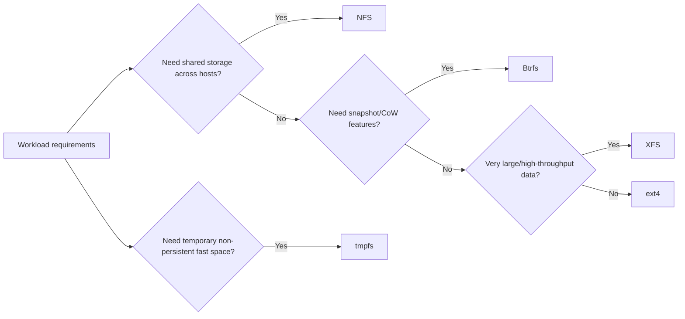

Linux supports multiple filesystem families, each optimized for different constraints such as consistency guarantees, metadata scalability, snapshot capability, or networked access. This page compares common choices and provides a practical selection framework for day-to-day operations [1], [2], [3], [4], [5].

## What is it?

A filesystem defines how data and metadata are organized, persisted, and recovered. Through VFS, Linux exposes a unified syscall interface while delegating implementation details to filesystem-specific drivers [6].

This page focuses on frequently encountered filesystems:

- `ext4`: stable general-purpose local filesystem [1]
- `XFS`: high-scale journaling filesystem for large/throughput-heavy workloads [2]
- `Btrfs`: CoW filesystem with snapshots and checksums [3]
- `tmpfs`: memory-backed transient filesystem [4]
- `NFS`: network filesystem client stack [5], [7]

## Why do we need it? Where do we use it?

Filesystem selection has direct impact on reliability, performance, operational tooling, and recovery strategy. Choosing a filesystem without workload fit often causes avoidable incidents.

Typical placements:

- ext4: operating system and mixed-application hosts
- XFS: large data partitions and metadata-parallel workloads
- Btrfs: snapshot-heavy environments and integrity-focused setups
- tmpfs: temporary scratch space and memory-backed runtime data
- NFS: shared data across hosts

## History Lesson

| When | What                                                                            |
| ---- | ------------------------------------------------------------------------------- |
| 1989 | NFSv2 is standardized (RFC 1094), enabling broad UNIX network file sharing [8]. |
| 1995 | NFSv3 extends scale and interoperability (RFC 1813) [9].                        |
| 2008 | ext4 becomes mainstream as the successor to ext3 [1].                           |
| 2009 | Btrfs joins mainline Linux with CoW and snapshot capabilities [3].              |
| 2016 | NFSv4.2 is standardized (RFC 7862) with additional protocol features [10].      |

## Interaction with other topics?

- [Linux VFS](/kb/storage/vfs): all filesystems are consumed through the VFS interface.
- [Inodes](/kb/storage/inodes): inode metadata model appears consistently across filesystem families.
- [Mounting](/kb/storage/mounting): filesystem choice is activated and parameterized through mount operations.
- [Infrastructure as Code](/kb/iac/terraform): storage type and mount policy should be codified for reproducibility.

## How does it work?

From the application perspective, VFS dispatches operations to filesystem-specific code paths, while each filesystem applies its own allocation, journaling, CoW, and recovery semantics [1], [2], [3], [6].

### Comparison matrix

| Filesystem | Primary model                        | Strengths                                      | Trade-offs                                                        | Typical use                              |
| ---------- | ------------------------------------ | ---------------------------------------------- | ----------------------------------------------------------------- | ---------------------------------------- |
| ext4       | Journaling, extent-based             | Mature, predictable, broad tooling             | Fewer native advanced data-management features vs CoW filesystems | General-purpose local volumes            |
| XFS        | Journaling, highly scalable metadata | Strong performance at scale, large filesystems | Operational behavior differs from ext4 defaults                   | Large, high-throughput data volumes      |
| Btrfs      | Copy-on-write + checksums            | Snapshots, subvolumes, integrity features      | Requires good operational familiarity                             | Snapshot/integrity-oriented environments |
| tmpfs      | RAM-backed virtual FS                | Very fast temporary storage                    | Non-persistent, memory pressure risk                              | Temporary files and runtime scratch data |
| NFS        | Network filesystem protocol          | Shared storage across systems                  | Network and server dependency                                     | Shared application/storage paths         |

### Filesystem selection workflow



## Examples: Usage or Theory

### Example 1: Inspect active filesystem types on a host

Prerequisites: Linux host.

```bash
$ set -euo pipefail
$ df -T
$ findmnt -o TARGET,SOURCE,FSTYPE,OPTIONS
$ lsblk -f
```

### Example 2: Temporary `tmpfs` mount for experiments

```bash
$ set -euo pipefail
$ sudo mkdir -p /mnt/tmpfs-demo
$ sudo mount -t tmpfs -o size=64M tmpfs /mnt/tmpfs-demo
$ df -T /mnt/tmpfs-demo
$ sudo umount /mnt/tmpfs-demo
```

Expected output shape:

```text
Filesystem Type 1K-blocks  Used Available Use% Mounted on
tmpfs      tmpfs    65536     0     65536   0% /mnt/tmpfs-demo
```

### Example 3: Check filesystem backing a critical path

```bash
$ set -euo pipefail
$ findmnt -T /var/lib -o TARGET,SOURCE,FSTYPE,OPTIONS
```

## References and further reading

[1] Linux Kernel Documentation, "ext4 Filesystem." Accessed: Feb. 21, 2026. [Online]. Available: https://docs.kernel.org/6.16/admin-guide/ext4.html

[2] Linux Kernel Documentation, "XFS Filesystem." Accessed: Feb. 21, 2026. [Online]. Available: https://docs.kernel.org/admin-guide/xfs.html

[3] Linux Kernel Documentation, "Btrfs." Accessed: Feb. 21, 2026. [Online]. Available: https://docs.kernel.org/6.1/filesystems/btrfs.html

[4] M. Kerrisk, "tmpfs(5)." Accessed: Feb. 21, 2026. [Online]. Available: https://man7.org/linux/man-pages/man5/tmpfs.5.html

[5] Linux Kernel Documentation, "NFS Client." Accessed: Feb. 21, 2026. [Online]. Available: https://docs.kernel.org/6.1/admin-guide/nfs/nfs-client.html

[6] Linux Kernel Documentation, "Virtual Filesystem." Accessed: Feb. 21, 2026. [Online]. Available: https://docs.kernel.org/filesystems/vfs.html

[7] M. Kerrisk, "nfs(5)." Accessed: Feb. 21, 2026. [Online]. Available: https://man7.org/linux/man-pages/man5/nfs.5.html

[8] R. Sandberg et al., "Network File System Protocol Specification," RFC 1094, Mar. 1989. [Online]. Available: https://www.rfc-editor.org/rfc/rfc1094

[9] B. Callaghan et al., "NFS Version 3 Protocol Specification," RFC 1813, Jun. 1995. [Online]. Available: https://www.rfc-editor.org/rfc/rfc1813

[10] C. Lever et al., "Network File System (NFS) Version 4 Minor Version 2 Protocol," RFC 7862, Nov. 2016. [Online]. Available: https://www.rfc-editor.org/rfc/rfc7862
