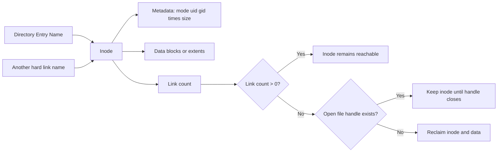

An inode is the filesystem object that stores metadata and identity for files, directories, and other filesystem entities. Names are not stored in inodes; names are handled by directory entries (dentries), which is why renames do not change inode identity [1], [2], [3].

## What is it?

In Linux, an inode represents persistent metadata such as file mode, ownership, timestamps, link count, and size. User space typically accesses these fields through `stat(2)` and related interfaces [1], [3].

Inode identity is local to a filesystem instance. The pair `(st_dev, st_ino)` is the practical unique identifier on a running host [1], [3].

## Why do we need it? Where do we use it?

Understanding inodes is essential for:

- debugging hard-link behavior
- investigating "disk full" conditions related to inode exhaustion
- understanding why deleted-but-open files still consume space
- correlating file identity across renames and path changes

Inode-level knowledge is heavily used in incident response and filesystem forensics [1], [2].

## History Lesson

| When  | What                                                                                         |
| ----- | -------------------------------------------------------------------------------------------- |
| 1970s | UNIX establishes inode-based file identity and metadata design [1].                          |
| 1991  | Linux adopts the Unix inode model in its filesystem architecture [2].                        |
| 2008  | POSIX.1-2008 consolidates standardized `stat`-family semantics used by Linux interfaces [3]. |

## Interaction with other topics?

- [Linux VFS](/kb/storage/vfs): VFS resolves names to inode-backed objects.
- [Dentries](/kb/storage/dentry): dentries map path components to inodes.
- [Mounting](/kb/storage/mounting): inode identity remains local to each mounted filesystem instance.
- [Filesystem examples](/kb/storage/filesystems): ext4/XFS/Btrfs differ in implementation, but expose inode semantics through VFS.

## How does it work?

Inode behavior depends on the name-to-object split:

1. A directory entry maps a name to an inode number.
2. The inode stores metadata and points to file data blocks (filesystem-specific).
3. Multiple dentries can point to the same inode (hard links).
4. File data is reclaimed only when link count is zero **and** no process keeps the file open [1], [2].



## Examples: Usage or Theory

### Example 1: Demonstrate hard links share one inode

Prerequisites: Linux host with write access to `/tmp`.

```bash
$ set -euo pipefail
$ WORKDIR="/tmp/inode-demo"
$ rm -rf "${WORKDIR}"
$ mkdir -p "${WORKDIR}"
$ printf 'demo-data\n' > "${WORKDIR}/file-a"
$ ln "${WORKDIR}/file-a" "${WORKDIR}/file-b"
$ ls -li "${WORKDIR}/file-a" "${WORKDIR}/file-b"
```

Expected output shape:

```text
123456 -rw-r--r-- 2 user group ... /tmp/inode-demo/file-a
123456 -rw-r--r-- 2 user group ... /tmp/inode-demo/file-b
```

Same inode number and link count `2` show that both names reference one inode [1].

### Example 2: Inspect inode metadata fields via `stat`

```bash
$ set -euo pipefail
$ stat --printf 'dev=%d ino=%i mode=%f links=%h uid=%u gid=%g size=%s\n' /etc/passwd
```

## References and further reading

[1] M. Kerrisk, "inode(7)." Accessed: Feb. 21, 2026. [Online]. Available: https://www.man7.org/linux/man-pages/man7/inode.7.html

[2] Linux Kernel Documentation, "Virtual Filesystem." Accessed: Feb. 21, 2026. [Online]. Available: https://docs.kernel.org/filesystems/vfs.html

[3] M. Kerrisk, "stat(2)." Accessed: Feb. 21, 2026. [Online]. Available: https://man7.org/linux/man-pages/man2/stat.2.html
