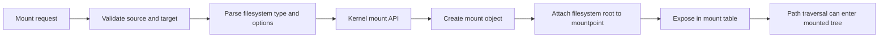

Mounting connects a filesystem instance into the global pathname namespace. It is the mechanism that turns storage objects (local devices, virtual filesystems, network shares) into accessible directory trees [1], [2].

## What is it?

A mount operation attaches a filesystem root to a mountpoint directory. From that moment, pathname traversal entering the mountpoint switches to the mounted filesystem tree [1], [3].

Persistent mount configuration is usually defined in `/etc/fstab`, while runtime state is visible through `/proc/mounts`, `/proc/self/mountinfo`, and tools such as `findmnt` [1], [2], [4].

## Why do we need it? Where do we use it?

Mounting is fundamental for system boot, application data paths, container runtime isolation, and security hardening. You use it to:

- activate persistent volumes and partitions
- attach temporary filesystems (e.g., `tmpfs`)
- enforce policy via mount options (`nosuid`, `nodev`, `noexec`)
- isolate workloads with mount namespaces [1], [3], [5]

## History Lesson

| When           | What                                                                                                   |
| -------------- | ------------------------------------------------------------------------------------------------------ |
| Version 6 UNIX | `mount` appears as a core UNIX system administration primitive [1].                                    |
| 4.0BSD era     | `fstab` file format appears for static filesystem definitions [2].                                     |
| Modern Linux   | mount namespaces and advanced mount APIs enable container isolation and safer runtime composition [5]. |

## Interaction with other topics?

- [Linux VFS](/kb/storage/vfs): mountpoints redirect path traversal between filesystem trees.
- [Dentries](/kb/storage/dentry): path resolution crosses mount boundaries while preserving lookup semantics.
- [Container](/kb/container): container runtimes rely heavily on namespace-aware mount operations.

## How does it work?

Mount flow at a high level:



### Namespace-oriented architecture view

```d2
direction: right

hostns: Host Mount Namespace {
  rootfs: /
  data: /data
  log: /var/log
}

containerns: Container Mount Namespace {
  rootfs_c: /
  data_c: /data
}

disk: /dev/nvme0n1p2
nfs: nfs-server:/export

disk -> hostns.data: mount ext4
nfs -> hostns.log: mount nfs
hostns.data -> containerns.data_c: bind mount
```

## Examples: Usage or Theory

### Example 1: Validate `/etc/fstab` safely before reboot

Prerequisites: Linux host with `findmnt` (util-linux).

```bash
$ set -euo pipefail
$ sudo findmnt --verify
```

Expected output shape:

```text
Success, no errors or warnings detected
```

### Example 2: Temporary bind mount for path remapping

```bash
$ set -euo pipefail
$ sudo mkdir -p /tmp/mnt-source /tmp/mnt-target
$ sudo touch /tmp/mnt-source/example.txt
$ sudo mount --bind /tmp/mnt-source /tmp/mnt-target
$ ls -la /tmp/mnt-target
$ sudo umount /tmp/mnt-target
```

### Example 3: `/etc/fstab` entry template

```text
UUID=1234-5678 /data ext4 defaults,noatime,nodev,nosuid 0 2
```

## References and further reading

[1] M. Kerrisk, "mount(8)." Accessed: Feb. 21, 2026. [Online]. Available: https://man7.org/linux/man-pages/man8/mount.8.html

[2] M. Kerrisk, "fstab(5)." Accessed: Feb. 21, 2026. [Online]. Available: https://man7.org/linux/man-pages/man5/fstab.5.html

[3] Linux Kernel Documentation, "Virtual Filesystem." Accessed: Feb. 21, 2026. [Online]. Available: https://docs.kernel.org/filesystems/vfs.html

[4] M. Kerrisk, "proc_pid_mountinfo(5)." Accessed: Feb. 21, 2026. [Online]. Available: https://man7.org/linux/man-pages/man5/proc_pid_mountinfo.5.html

[5] M. Kerrisk, "mount_namespaces(7)." Accessed: Feb. 21, 2026. [Online]. Available: https://man7.org/linux/man-pages/man7/mount_namespaces.7.html
