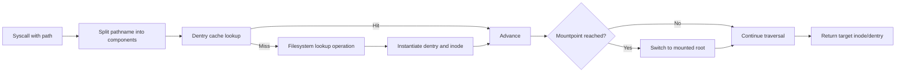

The Linux Virtual File System (VFS) is the kernel abstraction that makes path-based system calls work consistently across different filesystem implementations. Whether a file lives on ext4, XFS, Btrfs, or NFS, user space still uses the same syscall API (`open`, `read`, `write`, `stat`) because VFS normalizes the interface [1], [2].

## What is it?

VFS is an in-kernel framework that routes generic file operations to filesystem-specific implementations. It owns core objects such as inodes, dentries, open file descriptions, and mount references, and coordinates lookup, permission checks, and operation dispatch [1], [2], [3].

VFS does **not** define on-disk layout. That remains the responsibility of each filesystem driver (for example ext4 or XFS) [1].

## Why do we need it? Where do we use it?

Without VFS, every filesystem would expose incompatible semantics to user space. VFS solves this by providing stable syscall behavior, shared cache infrastructure, and a uniform namespace model across mounted filesystems [1], [3].

You use VFS concepts whenever you:

- trace file access errors (`ENOENT`, `ENOTDIR`, `EACCES`)
- diagnose path traversal issues across mountpoints
- analyze metadata cache behavior and lookup latency
- reason about filesystem-agnostic application behavior

## History Lesson

| When | What                                                                                                |
| ---- | --------------------------------------------------------------------------------------------------- |
| 1991 | Linux starts with a Unix-like architecture and evolves a VFS layer for filesystem abstraction [1].  |
| 2008 | POSIX.1-2008 standardizes `openat()`-style APIs used by modern path handling models [4].            |
| 2020 | Linux introduces `openat2(2)` with stricter path resolution controls for safer lookup behavior [4]. |

## Interaction with other topics?

- [Inodes](/kb/storage/inodes): VFS uses inodes as object identity + metadata containers.
- [Dentries](/kb/storage/dentry): VFS uses dentries to cache path component resolution.
- [Mounting](/kb/storage/mounting): VFS switches filesystem trees at mountpoints during path traversal.
- [Container](/kb/container): container isolation depends on mount namespace and VFS path semantics.

## How does it work?

At a high level, VFS performs three phases:

1. Resolve pathname components (`path_resolution(7)`) [3].
2. Map to inode and open-file state.
3. Dispatch operation to filesystem-specific handlers.

### VFS architecture view

```d2
direction: right

classes: {
  core: {
    style: {
      fill: "#E8FCE8"
      stroke: "#2F7A32"
      border-radius: 8
    }
  }
}

proc: User Process {shape: person}
sys: Syscall Layer (open/stat/read) {class: core}
vfs: VFS Core {class: core}
dcache: Dentry Cache {class: core}
icache: Inode Cache {class: core}
fsops: Filesystem Ops Table {class: core}
fsimpl: Filesystem Implementation {class: core}

proc -> sys: pathname + flags
sys -> vfs: syscall entry
vfs -> dcache: lookup component
vfs -> icache: resolve inode state
vfs -> fsops: select op handlers
fsops -> fsimpl: execute fs-specific logic
```

### Path lookup workflow



## Examples: Usage or Theory

### Example 1: Inspect VFS-visible filesystem support and active mount for a path

Prerequisites: Linux host.

```bash
$ set -euo pipefail
$ TARGET_PATH="/etc/passwd"
$ cat /proc/filesystems
$ findmnt -T "${TARGET_PATH}" -o TARGET,SOURCE,FSTYPE,OPTIONS
$ stat "${TARGET_PATH}"
```

Expected output shape:

```text
TARGET SOURCE     FSTYPE OPTIONS
/      /dev/sda2  ext4   rw,relatime,...
```

### Example 2: Observe path-resolution error propagation

```bash
$ set -euo pipefail
$ stat /definitely/not/present
```

Expected output shape:

```text
stat: cannot stat '/definitely/not/present': No such file or directory
```

This is the userspace view of an `ENOENT` resolution failure [3], [4].

## References and further reading

[1] Linux Kernel Documentation, "Virtual Filesystem." Accessed: Feb. 21, 2026. [Online]. Available: https://docs.kernel.org/filesystems/vfs.html

[2] Linux Kernel Documentation, "Dentry Cache (dcache)." Accessed: Feb. 21, 2026. [Online]. Available: https://www.kernel.org/doc/html/latest/filesystems/dcache.html

[3] M. Kerrisk, "path_resolution(7)." Accessed: Feb. 21, 2026. [Online]. Available: https://man7.org/linux/man-pages/man7/path_resolution.7.html

[4] M. Kerrisk, "open(2)." Accessed: Feb. 21, 2026. [Online]. Available: https://man7.org/linux/man-pages/man2/open.2.html

[5] M. Kerrisk, "stat(2)." Accessed: Feb. 21, 2026. [Online]. Available: https://man7.org/linux/man-pages/man2/stat.2.html
